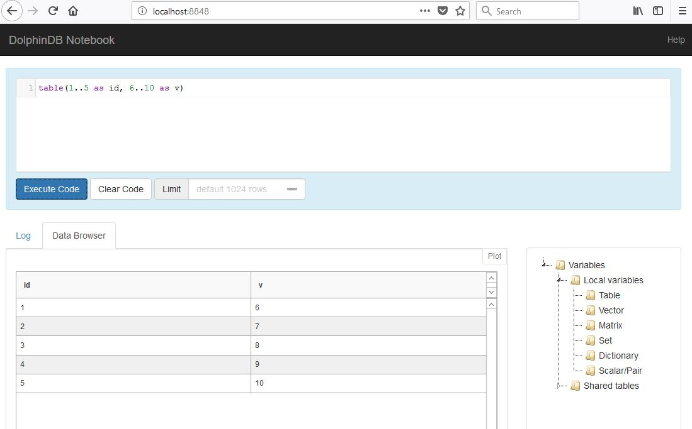

# 单节点部署(嵌入式ARM版本)

## 1. 系统要求

操作系统：Linux（内核3.10以上版本）

内存：2GB以上

Flash：8GB以上

支持的ARM CPU:  

- CORTEXA15
- CORTEXA9
- ARMV7  
- ARMV8
- CORTEXA53  
- CORTEXA57  
- CORTEXA72  
- CORTEXA73  
- FALKOR  
- THUNDERX  
- THUNDERX2T99  
- TSV110

DolphinDB ARM版使用的交叉编译器32位系统为arm-linux-gnueabihf4.9，64位系统为aarch64-linux-gnu_4.9.3。若用户在实际板子上运行时出现问题，请反馈给我们（support@dolphindb.com）。

## 2. 安装系统

从DolphinDB网站下载DolphinDB database嵌入式ARM版软件包，解压缩后即可运行。

例如解压到如下目录：

```sh
/DolphinDB
```

## 3. 软件授权许可更新

如果用户拿到企业版试用授权许可，只需用其替换如下文件即可。

```sh
/DolphinDB/server/dolphindb.lic
```

## 4. 运行DolphinDB server

进入server目录 /DolphinDB/server/, 运行dolphindb。

在运行dolphindb可执行文件前，需要修改文件权限：

```sh
chmod 777 dolphindb
```

然后可在dolphindb.cfg文件中修改配置参数:

系统默认端口号是8848。如果需要指定其它端口可以通过参数localSite设置，例如修改端口为8900：

```txt
localSite=localhost:8900:local8900
```

可通过参数maxMemSize来指定DolphinDB可用的最大内存，以GB为单位，例如修改为0.8GB：

```sh
maxMemSize=0.8d
```

参数regularArrayMemoryLimit设置数组的内存限制（以MB为单位）。该参数必须是2的指数幂。默认值是512。建议根据实际内存大小设置，例如修改为64MB：

```sh
regularArrayMemoryLimit=64
```

另外建议根据闪存大小修改maxLogSize（当日志文件达到指定大小（单位为MB）时，系统会将日志文件存档。默认值是1024，最小值是100），例如修改为100MB：

```sh
maxLogSize=100

```

在Linux环境中可执行以下指令：

```sh
./dolphindb
```

在Linux后台执行dolphindb，可执行以下指令:

```sh
./startSingle.sh
```

建议通过Linux命令nohup（头）和 &（尾）启动为后台运行模式，这样即使终端失去连接，DolphinDB也会持续运行。

`-console`默认值为1，如果要设置为后台运行，必须要设置为0（`-console 0`)，否则系统运行一段时间后会自动退出。

## 5. 网络连接到DolphinDB server

到浏览器中输入设备ip地址:8848(或其它端口号)。目前支持Chrome与Firefox浏览器。请注意，在浏览器中连接DolphinDB server时，若10分钟内无命令执行，系统会自动关闭会话以释放DolphinDB系统资源。建议用户在DolphinDB GUI中编写代码与执行命令。DolphinDB GUI中的会话在用户关闭之前会一直存在。

## 6. 通过网络界面运行DolphinDB脚本

在DolphinDB notebook的编辑器窗口输入以下DolphinDB代码：

```txt
table(1..5 as id, 6..10 as v)
```

下图展示了运行结果。



## 7. server版本升级

1. 正常关闭单节点。

2. 备份旧版本的元数据文件。单节点元数据的默认存储目录：

   ```sh
   /DolphinDB/server/local8900/dfsMeta/
   ```
   ```sh
   /DolphinDB/server/local8900/storage/CHUNK_METADATA/
   ```
   在linux上可在server目录执行以下命令备份单节点元数据：
   ```sh
   mkdir backup
   cp -r local8900/dfsMeta/ backup/dfsMeta
   cp -r local8900/storage/CHUNK_METADATA/ backup/CHUNK_METADATA
   ```
   
>  注意元数据文件可能通过配置文件指定存储在其它目录，如果在默认路径没有找到上述文件，可以通过查询配置文件中的dfsMetaDir参数和chunkMetaDir参数确认元数据文件的存储目录。若配置中未指定dfsMetaDir参数和chunkMetaDir参数，但是配置了volumes参数，CHUNK_METADATA目录在相应的volumes参数指定的目录下。

3. 下载需要更新版本的安装包。可以通过官网（[www.dolphindb.cn](http://www.dolphindb.cn/)）下载，在linux上可通过执行以下命令下载1.30.6版本的安装包： 

   ```sh
   wget https://www.dolphindb.cn/downloads/DolphinDB_Linux64_V1.30.6.zip
   ```

>  注意：上述命令中不同版本的号会有不同的文件名。

4. 解压。在linux上可通过执行以下命令解压1.30.6版本的安装包至v1.30.6目录：

   ```sh
   unzip DolphinDB_Linux64_V1.30.6.zip -d v1.30.6
   ```

5. 拷贝解压后的server子目录下文件除config目录、data目录、log目录和dolphindb.cfg外的所有文件和子目录到旧版本安装目录server下覆盖同名文件。

>  注意若有在旧版本的系统初始化脚本dolphindb.dos中添加脚本，请不要覆盖。旧版本的dolphindb.lic若是企业版license，也不要覆盖。

6. 重新启动单节点，GUI连接该节点，执行以下命令查看版本信息，检查升级是否成功：

   ```sh
   version()

7. 也可以使用 clusterDemo/upgrade.sh 来升级 server 版本
   ```