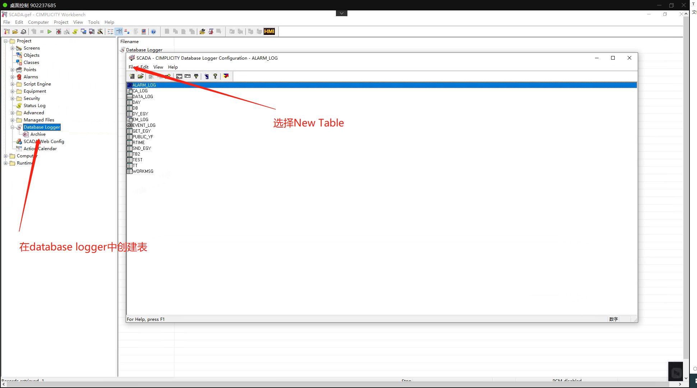
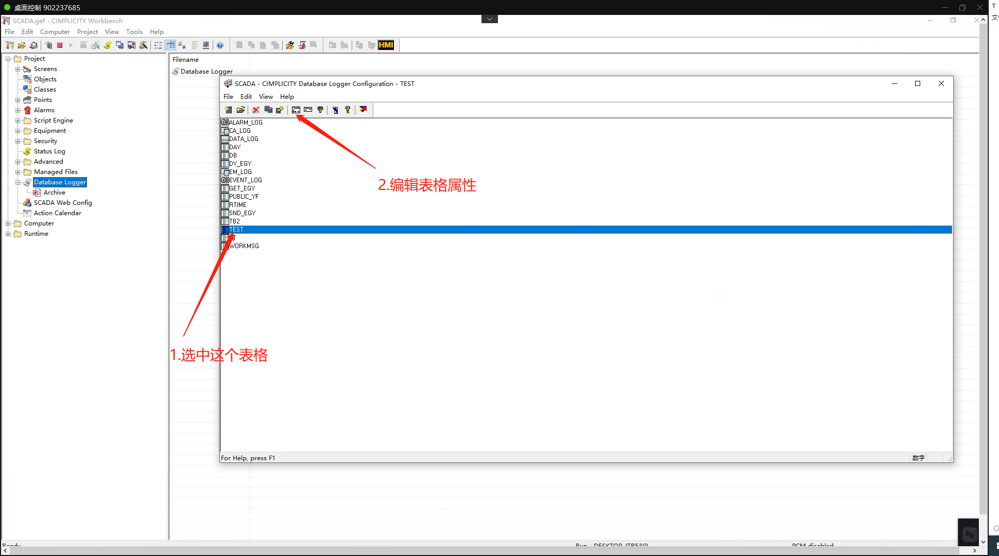
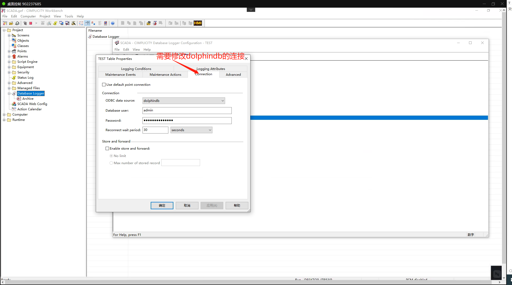
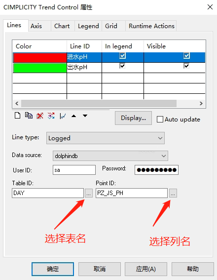
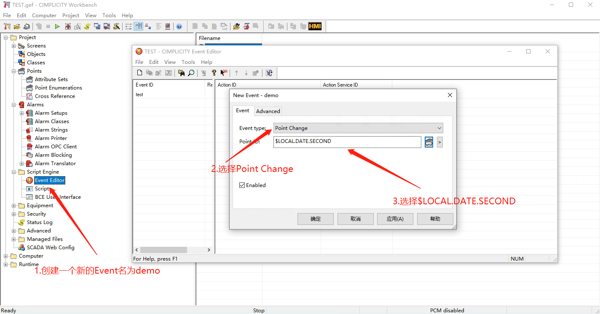
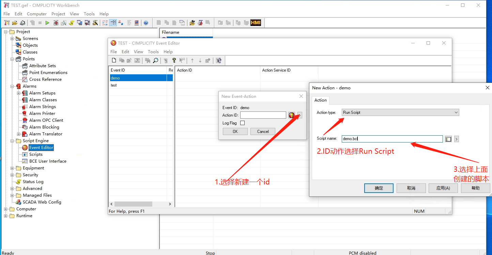
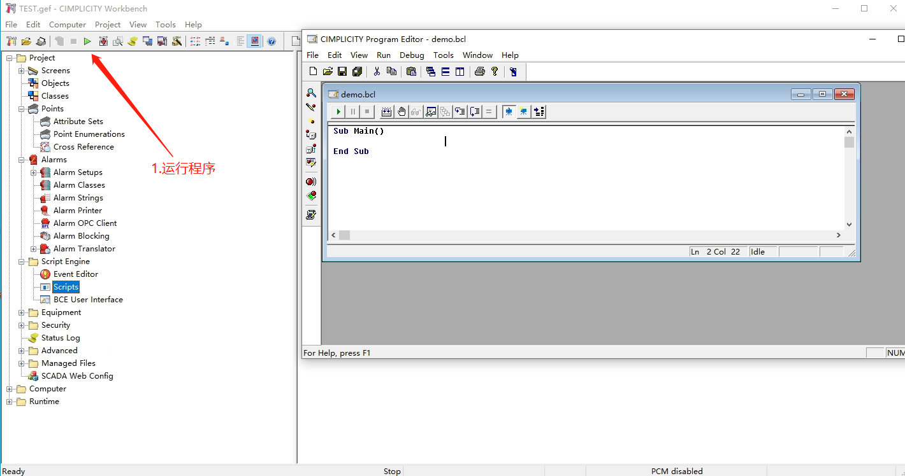

## Cimplicty通过ODBC访问DolphinDB

### 1.概述

GE组态软件Cimplicity是美国通用公司开发的，用于快速构造和生成计算机监控系统的组态软件。它能够在基于Microsoft 的各种Windows 平台上运行，通过对现场数据的采集处理，以动画显示、报警处理、流程控制和报表输出等多种方式向用户提供解决实际工程问题的方案，在自动化领域有着广泛的应用。

DolphinDB用于海量时序数据的存取和分析，支持关系模型，兼容宽列数据库与关系数据库的功能，并且像传统的关系数据库一样易于使用。DolphinDB支持SQL查询，提供了ODBC接口，本文详细介绍在Cimplicity中配置ODBC连接及查询DolphinDB中数据并展示的步骤。

### 2.下载ODBC驱动

DolphinDB ODBC驱动在gitee中可以下载：

[下载链接](https://gitee.com/dolphindb/DolphinDBPlugin/blob/master/odbc/README.md)

### 3.配置odbc连接

#### 3.1  安装驱动：

以管理员身份运行CMD命令提示符，命令示例如下：

```
C:\Windows\SysWOW64\odbcconf.exe /A  {INSTALLDRIVER "DolphinDBDriver|Driver=path_to\libddbodbc.dll|Setup=path_to\libddbodbc.dll"} 
```

#### 3.2 配置用户DSN：

以管理员身份运行CMD命令提示符，命令示例如下：

```
  C:\Windows\SysWOW64\odbcconf.exe  /A {CONFIGDSN "DolphinDBDriver" "DSN=dolphindb|SERVER=127.0.0.1|PORT=8848|UID=admin|PWD=123456"} 
```

#### 3.3 配置系统DSN：

以管理员身份运行CMD命令提示符，命令示例如下：

```
  C:\Windows\SysWOW64\odbcconf.exe  /A {CONFIGSYSDSN "DolphinDBDriver" "DSN=dolphindb|SERVER=127.0.0.1|PORT=8848|UID=admin|PWD=123456"} 
```

## 4.自动创建数据表格
在项目中我们不需要在数据库中手动创建表格。只需要在DataBase_Logger中选择配置一个表格配置连接即可。





## 5.在Screens中对数据进行图像展示
对于图像的线条展示是通过Trend Control组件进行的。我们可以通过图示方法来选择展示的表格和列的数据。



## 6. 实例

#### 例1：

1.创建DolphinDB数据库
在DolphinDB中创建一个库表`dfs://demo/tick`，并插入数据列：

```
dbDate = database("", VALUE, 2020.01.01..2020.01.02)
dbSymbol=database("", HASH, [SYMBOL, 10])
db = database("dfs://demo", COMPO, [dbDate, dbSymbol])
db.createPartitionedTable(table(1000:0,`UpdateTime`TradeDate`Market`SecurityID`PreCloPrice`OpenPrice`HighPrice`LowPrice`LastPrice`TradNumber`TradVolume`Turnover`TotalBidVol`WAvgBidPri`TotalAskVol`WAvgAskPri`IOPV`AskPrice1`AskVolume1`AskPrice2`AskVolume2`AskPrice3`AskVolume3`AskPrice4`AskVolume4`AskPrice5`AskVolume5`AskPrice6`AskVolume6`AskPrice7`AskVolume7`AskPrice8`AskVolume8`AskPrice9`AskVolume9`AskPrice10`AskVolume10`BidPrice1`BidVolume1`BidPrice2`BidVolume2`BidPrice3`BidVolume3`BidPrice4`BidVolume4`BidPrice5`BidVolume5`BidPrice6`BidVolume6`BidPrice7`BidVolume7`BidPrice8`BidVolume8`BidPrice9`BidVolume9`BidPrice10`BidVolume10`NumOrdersB1`NumOrdersB2`NumOrdersB3`NumOrdersB4`NumOrdersB5`NumOrdersB6`NumOrdersB7`NumOrdersB8`NumOrdersB9`NumOrdersB10`NumOrdersS1`NumOrdersS2`NumOrdersS3`NumOrdersS4`NumOrdersS5`NumOrdersS6`NumOrdersS7`NumOrdersS8`NumOrdersS9`NumOrdersS10`LocalTime,[TIME,DATETIME,SYMBOL,SYMBOL,DOUBLE,DOUBLE,DOUBLE,DOUBLE,DOUBLE,INT,INT,DOUBLE,INT,DOUBLE,INT,DOUBLE,DOUBLE,DOUBLE,INT,DOUBLE,INT,DOUBLE,INT,DOUBLE,INT,DOUBLE,INT,DOUBLE,INT,DOUBLE,INT,DOUBLE,INT,DOUBLE,INT,DOUBLE,INT,DOUBLE,INT,DOUBLE,INT,DOUBLE,INT,DOUBLE,INT,DOUBLE,INT,DOUBLE,INT,DOUBLE,INT,DOUBLE,INT,DOUBLE,INT,DOUBLE,INT,INT,INT,INT,INT,INT,INT,INT,INT,INT,INT,INT,INT,INT,INT,INT,INT,INT,INT,INT,INT,TIME]),`tick,`TradeDate`SecurityID)
```

2.插入一条数据测试

```
t1=table(08:45:01.000 as UpdateTime,	2019.09.09 as TradeDate,`SH as Market, `600861 as SecurityID,9.67 as PreCloPrice,0 as OpenPrice,1 as	HighPrice,2 as 	LowPrice,3 as	LastPrice,4 as	TradNumber,5 as TradVolume,6 as Turnover,7 as TotalBidVol,8 as 	WAvgBidPri,9 as TotalAskVol,10 as WAvgAskPri,11 as	IOPV,12 as AskPrice1,13 as AskVolume1,14 as AskPrice2,15 as	AskVolume2,16 as	AskPrice3,17 as  AskVolume3,18 as AskPrice4,19 as AskVolume4,20 as AskPrice5,21 as AskVolume5,22 as AskPrice6,23 as AskVolume6,24 as 	AskPrice7,25 as  AskVolume7,26 as AskPrice8,27 as AskVolume8,28 as AskPrice9,29 as	AskVolume9,30 as AskPrice10,31 as AskVolume10,32 as BidPrice1,33 as BidVolume1,34 as BidPrice2,35 as BidVolume2,36 as  BidPrice3,37 as BidVolume3,38  as BidPrice4,39 as BidVolume4,40 as	 BidPrice5,41 as	BidVolume5,42 as BidPrice6,43 as  BidVolume6	,44 as BidPrice7,45 as BidVolume7,46 as BidPrice8,47 as BidVolume8,48 as	BidPrice9,49 as  BidVolume9,50 as BidPrice10,51 as BidVolume10,52 as  NumOrdersB1,53 as NumOrdersB2,54 as NumOrdersB3,55 as NumOrdersB4,56 as NumOrdersB5,57 as NumOrdersB6,58 as NumOrdersB7,59 as NumOrdersB8,60 as NumOrdersB9,61 as NumOrdersB10,62 as NumOrdersS1,63 as NumOrdersS2,64 as NumOrdersS3,65 as NumOrdersS4,66 as NumOrdersS5,67 as NumOrdersS6,68 as NumOrdersS7, 69 as NumOrdersS8,70 as NumOrdersS9,71 as NumOrdersS10,08:45:01.000 as LocalTime)
t=loadTable("dfs://demo","tick")
t.append!(t1)
```

3.在cimplicity中打开Workbench


4.创建脚本


示例脚本内容如下，执行如下脚本去查看dolphindb的数据发现有数据进入。

```
Sub Main()
Dim str1 As String
Dim str2 As String
Dim tm As String
Dim index As Integer
Dim str11 As String
Dim str12 As String
Dim str13 As String
Dim str14 As String
Dim str15 As String  
Dim str16 As String   
Dim str17 As String
Dim str18 As String
Dim str19 As String
Dim str20 As String    
On Error Resume Next    
    

    tm = format(now,"yyyy-mm-dd hh:mm:ss")

    Id&=SQLOpen("dsn=dolphindb;server=127.0.0.1;port=8848;uid=admin;pwd=123456;log=C:\\odbc_driver\\log\\odbc.log;",,4)
  
    str11="t1=table(08:45:01.000 as UpdateTime,temporalParse('"+ tm +"','y-M-d H:m:s') as TradeDate,`SH as Market, `600861 as SecurityID,9.67 as PreCloPrice,"
    str12="0 as OpenPrice,1 as    HighPrice,2 as     LowPrice,3 as    LastPrice,4 as    TradNumber,5 as TradVolume,6 as Turnover,7 as TotalBidVol,"    
    str13="8 as    WAvgBidPri,9 as TotalAskVol,10 as WAvgAskPri,11 as    IOPV,12 as AskPrice1,13 as AskVolume1,14 as AskPrice2,15 as    AskVolume2,"
    str14="16 as AskPrice3,17 as  AskVolume3,18 as AskPrice4,19 as AskVolume4,20 as AskPrice5,21 as AskVolume5,22 as AskPrice6,23 as AskVolume6,"
    str15="24 as AskPrice7,25 as  AskVolume7,26 as AskPrice8,27 as AskVolume8,28 as AskPrice9,29 as    AskVolume9,30 as AskPrice10,31 as AskVolume10,"    
    str16="32 as BidPrice1,33 as BidVolume1,34 as BidPrice2,35 as BidVolume2,36 as  BidPrice3,37 as BidVolume3,38  as BidPrice4,39 as BidVolume4,"    
    str17="40 as BidPrice5,41 as BidVolume5,42 as BidPrice6,43 as  BidVolume6 ,44 as BidPrice7,45 as BidVolume7,46 as BidPrice8,47 as BidVolume8,48 as BidPrice9,49 as  BidVolume9,"
    str18="50 as BidPrice10,51 as BidVolume10,52 as  NumOrdersB1,53 as NumOrdersB2,54 as NumOrdersB3,55 as NumOrdersB4,56 as NumOrdersB5,57 as NumOrdersB6,58 as NumOrdersB7,59 as NumOrdersB8,"
    str19="60 as NumOrdersB9,61 as NumOrdersB10,62 as NumOrdersS1,63 as NumOrdersS2,64 as NumOrdersS3,65 as NumOrdersS4,66 as NumOrdersS5,67 as NumOrdersS6,68 as NumOrdersS7, 69 as NumOrdersS8,70 as NumOrdersS9,71 as NumOrdersS10,08:45:01.000 as LocalTime)"
    str20=str11+str12+str13+str14+str15+str16+str17+str18+str19

    str1 = "login('admin','123456' )"
    str2 = "loadTable('dfs://demo','tick').append!(t1)"
    Qry& = SQLExecQuery(Id&,str1)
    Qry& = SQLExecQuery(Id&,str20)
    Qry& = SQLExecQuery(Id&,str2)
   
    Id&=SQLClose(Id&)

End Sub
```

#### 例2

本例通过Cimplicity每秒插入一条数据到DolphinDB的表中。

1.创建一个Event



2.创建一个action



3.运行整个程序，可在数据库端查看数据。




### 7. 注意事项：

* 通过Cimplictiy创建一个定时写入任务时，需要使用系统DSN，如果是用户DSN，系统无法调用，所以看起来像无法插入数据。


