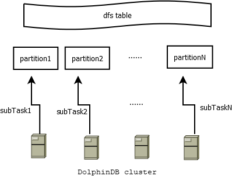
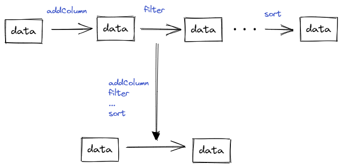

# SQL优化案例：数据ETL

在数据分析领域，通常需要将源数据通过清洗，处理，整合（即Extraction-Transformation-Loading (ETL)过程），输出一份高质量、满足一致性要求的数据，以便提高建模分析的工作效率。常规做法是依次遍历数据集，对数据集的每个分片处理，然后汇总输出。本文通过一个 SQL 优化案例，讲述如何使用 DolphinDB 分布式计算能力，将上述过程的性能提高70余倍。

本文通过以下步骤来演示优化过程
- [SQL优化案例：数据ETL](#sql优化案例数据etl)
- [1 场景简述与数据准备](#1-场景简述与数据准备)
  - [1.1 场景简述](#11-场景简述)
  - [1.2 数据准备](#12-数据准备)
  - [1.3 开发环境](#13-开发环境)
- [2 优化前代码](#2-优化前代码)
- [3优化分析](#3优化分析)
  - [3.1 处理思路](#31-处理思路)
  - [3.2 代码分析](#32-代码分析)
  - [3.3 优化方法](#33-优化方法)
- [4 优化后代码](#4-优化后代码)
- [5 总结](#5-总结)
- [6 附录](#6-附录)

# 1 场景简述与数据准备

## 1.1 场景简述

处理历史交易数据，增加部分字段，例如累计交易额、买卖标识、转换字段的数据类型，生成一份新的数据。本案例中处理20个交易日的逐笔成交数据，数据量每天大概为5G。

## 1.2 数据准备

源表结构：

| name        | typeString | comment |
| ----------- | ---------- | ------- |
| securityID  | STRING     | 股票编号    |
| tradingdate | DATE       | 交易日     |
| tradingtime | TIMESTAMP  | 交易时间    |
| tradetype   | SYMBOL     | 成交类型    |
| recid       | INT        | 消息记录号   |
| tradeprice  | DOUBLE     | 成交价格    |
| tradevolume | INT        | 成交数量    |
| buyorderid  | INT        | 买单ID    |
| sellorderid | INT        | 卖单ID    |
| unix        | TIMESTAMP  | unix时间戳 |

目标表结构:

| name        | typeString | comment |
| ----------- | ---------- | ------- |
| securityID  | SYMBOL     | 股票编号    |
| tradingdate | INT        | 交易日     |
| tradingtime | STRING     | 交易时间    |
| recid       | INT        | 消息ID    |
| tradeprice  | DOUBLE     | 成交价格    |
| tradevolume | DOUBLE     | 成交数量    |
| tradeamount | DOUBLE     | 成交金额    |
| buyrecid    | INT        | 买单ID    |
| sellrecid   | INT        | 卖单ID    |
| buysellflag | SYMBOL     |         |
| unix        | LONG       | unix时间戳 |

源表和目标表均使用 OLAP 引擎，采用日期 VALUE + 股票 HASH 分区（20个 hash 分区）的组合分区方式。每天的数据包含3000只股票，6000万行的交易记录。具体建库建表及模拟数据脚本参考附录[数据准备脚本](script/data_etl/createData.dos)。

## 1.3 开发环境

采用数据节点 * 3，控制节点 * 3 的高可用集群。每个服务器配置如下：

- 操作系统：CentOS Linux release 7.9.2009 (Core)
- CPU: 16 vCores
- 内存：128G
- 磁盘：SSD * 4

# 2 优化前代码

针对以上场景，按通常的数据处理思路，代码如下：
```python
def genDataV1(date1, date2){
	tradeSrc = loadTable("dfs://originData", "trade")
	tradeTgt = loadTable("dfs://formatData", "trade")
           for (aDate in date1..date2){
           	     tradeSecurityID = (exec distinct(securityID) from tradeSrc where tradingdate = aDate).shuffle()
          		 for (m in tradeSecurityID){		
		      		tradingdf = select  * from tradeSrc where securityID = m and tradingdate = aDate    //step1
		      		tradingdf["symbol"] = m + "SZ"        
		      		//print("stock " + m + ",date is " + aDate + ",tradingdf size " + tradingdf.size())  
		      		tradingdf["buysellflag"] =iif(tradingdf["sellorderid"] > tradingdf["buyorderid"],"S", "B")
		      		tradingdf["tradeamount"] = tradingdf["tradevolume"] * tradingdf["tradeprice"]
		      		tradingdf = tradingdf[(tradingdf["tradetype"] == "0") || (tradingdf["tradetype"] == "F")]
		      		tradingdf = select symbol,tradingdate, tradingtime, recid, tradeprice, tradevolume, tradeamount, buyorderid, sellorderid, buysellflag, unix from tradingdf
		     		tradingdf = select * from tradingdf order by symbol, tradingtime, recid     
		      		tradingdf.replaceColumn!("tradingdate", toIntDate(::date(tradingdf.tradingDate)))            
		      		tradingtime = string(exec tradingtime from tradingdf)
		      		tradingdf.replaceColumn!(`tradingtime, tradingtime)
		      		unix = long(exec unix from tradingdf)
		      		tradingdf.replaceColumn!(`unix, unix)                                             //stepM
		      		tradeTgt.append!(tradingdf)	      		
             }
	}
}
```
按交易日、股票，依次处理原始数据，然后将处理后的数据存储至新表。按上述代码执行20个交易日数据需要4.5小时。

# 3优化分析

## 3.1 处理思路

一个简单而强大的公式：完成一个计算问题的时间 t，满足：

` t = S / V`     

S：问题的空间复杂度：一次任务的数据量。

V：数据处理速度：每秒处理多少条记录。

缩短 t 的两个核心思路：

- 减小 S

通过索引技术、sharding 技术，减少需要处理的数据量。例如对包含上百个字段的表，一次查询往往只需要其中几个字段。可以利用 DolphinDB OLAP 系统的列存技术，在查询时只读取需要的列文件，减少查询的数据量。

- 提高 V

通过提高批处理数据量的大小、利用多线程并发、分布式处理等方式，来提高处理速度。

## 3.2 代码分析

综上考虑，需要从以下两方面来提高 ETL 效率：

- **减少 S**

本文场景的需求是处理所有的历史数据，故无法降低 S。

- **提高 V**

优化前的代码处理速度低，有以下几个原因：

1. 双重 for 循环

时间复杂度为：

`t = O(N) * O(M) * t0 = O(MN) * t0`

其中，N表示股票数量；M表示交易日；t0表示最内层处理逻辑的耗时。

按股票，日期执行双重循环，指定日期和股票，测试最内层 for 循环执行一次的耗时为400ms左右。整体代码执行预估耗时为：

`t ~= 3000  * 0.4 * 20 = 6.7 小时`

2. 往返延时（RTT）太多

RTT(Round-TripTime)，由上述代码可以看出，从 step1 到 stepM 对同一个数据表的数据操作了 M 次，而一些操作可以同步进行，例如过滤数据与排序可以在一次操作中完成。

3. 单点计算

上例中从 tradingdf 赋值语句开始：

```sql
tradingdf=select * from loadTable("dfs://test", 'szl2_stock_trade_daily') where symbol = m and tradingDate = date
```

之后的代码仅在单个节点进行计算，无法利用 DolphinDB 的分布式、高并发计算的优势。

## 3.3 优化方法

基于上面的分析，给出以下几个优化方法：

- 提高并发度
- 减少RTT
- 使用向量化处理

# 4 优化后代码

按天批量处理所有股票数据，DolphinDB 会将这一天20个分区内的3000个股票的数据，生成20个subTask并发处理，自动调度至集群中的各个节点，进行分布式计算。



图1-1

 优化后代码如下：

```python
def transformData(tradeDate){
	tradeSrc = loadTable("dfs://originData", "trade")
	tradeTgt = loadTable("dfs://formatData", "trade")
	data = select 
		securityID + "SZ" as securityID
		,toIntDate(tradingdate) as  tradingdate
		,tradingtime$STRING as tradingtime
		,recid as recid 
		,tradeprice
		,tradevolume
		,tradevolume * tradeprice as tradeamount     	
		,buyorderid as buyrecid
		,sellorderid as sellrecid
		,iif(sellorderid>  buyorderid,"S", "B") as buysellflag    	
		,unix$LONG as unix
	from tradeSrc
	where tradingdate = tradeDate and tradetype in ["0", "F"]
	tradeTgt.append!(data)
	flushOLAPCache()
}

allDays = 2022.05.01..2022.05.20
for(aDate in allDays){
	jobId = "transform_"+ strReplace(aDate$STRING, ".", "")	
	jobDesc = "transform data"
	submitJob(jobId, jobDesc, transformData, aDate)
}
```

以上代码处理一天内3000只股票的数据，大约需要40秒。通过submitJob的方式同时处理20个交易日的数据，在[maxBatchJobWorker](https://www.dolphindb.cn/cn/help/130/DatabaseandDistributedComputing/Configuration/StandaloneMode.html)=16（一般设置为 CPU 核数） 的设置下，总共耗时216秒，性能提升74倍。相对于原始代码，有以下几点进步：

- 分布式，并行度高

以上 select 部分的代码是分布式、并发执行的，并发度取决于分区的个数及集群可用的 [localExecutor](https://www.dolphindb.cn/cn/help/130/DatabaseandDistributedComputing/Configuration/StandaloneMode.html)（一般设置为 CPU 核数 - 1）。并且通过 [submitJob](https://www.dolphindb.cn/cn/help/FunctionsandCommands/FunctionReferences/s/submitJob.html) 的方式并行执行多个任务。

- RTT 少

所有的处理逻辑，包括过滤数据、类型转换、增加派生字段，通过一次 read 即可完成，无需反复读取数据和对数据进行转换。



图4-1

- 向量化

OLAP 引擎采用列式存储，一列数据读取到内存中以 vector 形式存储，因此，SQL 运算采用向量化方式，十分高效。

# 5 总结

在优化程序性能之前，可以先估算一下程序运行时间，空间复杂度等，分析下性能的瓶颈。对于大规模数据集，不建议使用 for，peach 等方式来处理，尤其不建议在 for 循环里进行同步的 IO 操作。建议使用 SQL，向量化编程等方式来发挥 DolphinDB 分布式，高并发计算的优势。

# 6 附录 

- [数据准备脚本](script/data_etl/createData.dos)
- [优化前代码](script/data_etl/origin.dos)
- [优化后代码](script/data_etl/sqlTuning.dos)