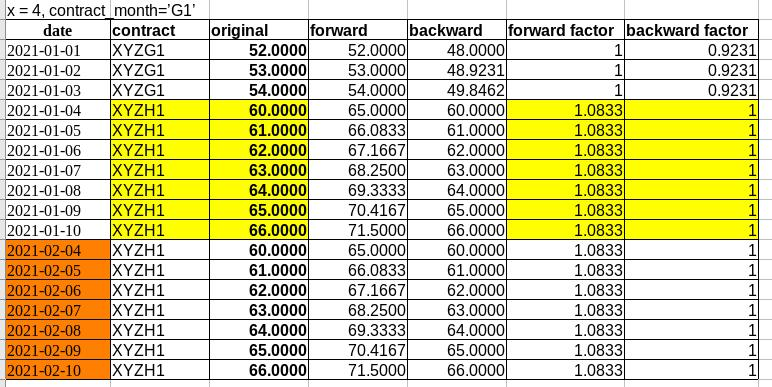
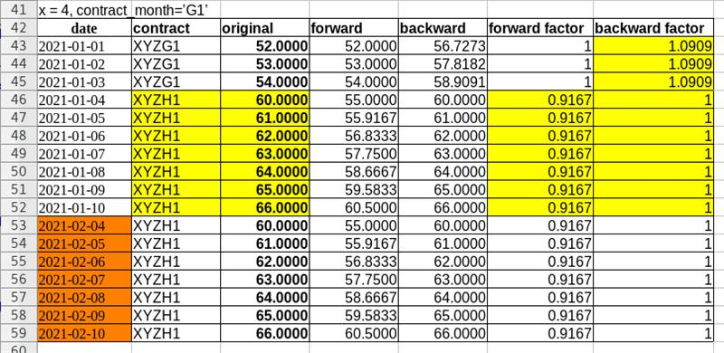
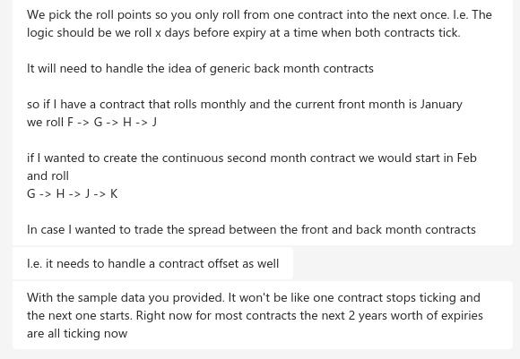
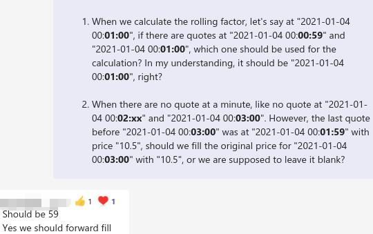
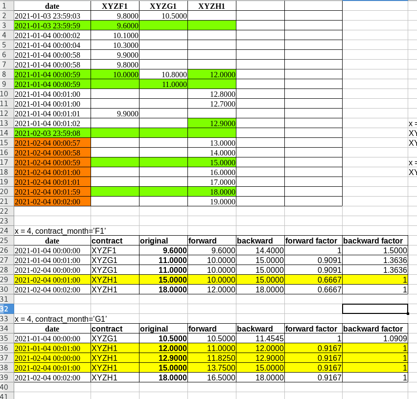

金融衍生品实践中，滚动合约是相当常用的分析手段。本案例教程将分作三个阶段，循序渐进由浅入深介绍如何在DolphinDB中使用滚动合约。


## Phase 1: 小样本数据

连续期货合约是把短期的期货合约数据，人为接续起来，拼合成的长期历史数据。拼合的规则有可能多种多样。以下是规则

 There are always many rules to follow. Below is the what Phase 1 need to do.

The schema for the input:

- date: the date

- contract: the future contract, for your information,

  - "XYZ" is the future itself, while the letter after means the contract's expiry month and the last number is for the expiry year

    for instance, you can take "H1" for the meaning of "expiry year month is March 2021"

- price: the price for the contract at the date

The schema for the output:

- date: the date

  contract: the future contract

  original: the contract's original price

  forward: the contract's adjusted forward price

  backward: the contract's adjusted backward price

To help you better understand the input, here is the corresponding pivot table:


| **date**   | **XYZF1** | **XYZG1** | **XYZH1** |
| ---------- | --------- | --------- | --------- |
| 2021-01-01 | 47.0000   |           |           |
| 2021-01-02 | 48.0000   |           |           |
| 2021-01-03 | 49.0000   |           |           |
| 2021-01-04 | 50.0000   | 55.0000   |           |
| 2021-01-05 |           | 56.0000   |           |
| 2021-01-06 |           | 57.0000   |           |
| 2021-01-07 |           | 58.0000   | 63.0000   |
| 2021-01-08 |           |           | 64.0000   |
| 2021-01-09 |           |           | 65.0000   |
| 2021-01-10 |           |           | 66.0000   |

As you can see, the roll date is "2021-01-04", where the future is rolled from "XYZF1" to "XYZG1", which means roll the future contract expiry date from January to February. Same story for the second roll date on "2021-01-07".

We want to get the adjusted forward and backward rolling price, which is the output file. Below is the version comes with adjusted factor:

| **date**   | **contract** | **original** | **forward** | **backward** | **forward factor** | **backward factor** |
| ---------- | ------------ | ------------ | ----------- | ------------ | ------------------ | ------------------- |
| 2021-01-01 | XYZF1        | **47.0000**  | 47.0000     | 56.1569      | 1                  | 1.1948275862069     |
| 2021-01-02 | XYZF1        | **48.0000**  | 48.0000     | 57.3517      | 1                  | 1.1948275862069     |
| 2021-01-03 | XYZF1        | **49.0000**  | 49.0000     | 58.5466      | 1                  | 1.1948275862069     |
| 2021-01-04 | XYZG1        | **55.0000**  | 50.0000     | 59.7414      | 0.909090909090909  | 1.08620689655172    |
| 2021-01-05 | XYZG1        | **56.0000**  | 50.9091     | 60.8276      | 0.909090909090909  | 1.08620689655172    |
| 2021-01-06 | XYZG1        | **57.0000**  | 51.8182     | 61.9138      | 0.909090909090909  | 1.08620689655172    |
| 2021-01-07 | XYZH1        | **63.0000**  | 52.7273     | 63.0000      | 0.836940836940837  | 1                   |
| 2021-01-08 | XYZH1        | **64.0000**  | 53.5642     | 64.0000      | 0.836940836940837  | 1                   |
| 2021-01-09 | XYZH1        | **65.0000**  | 54.4012     | 65.0000      | 0.836940836940837  | 1                   |
| 2021-01-10 | XYZH1        | **66.0000**  | 55.2381     | 66.0000      | 0.836940836940837  | 1                   |

* When it's a rolling date, the forward factor is derived by:

     factor for current contract * (price of current contract / price of next contract)

    in the example, forward factor is 0.909 on first rolling date "2021-01-04", for the reason 1 * (50 / 55) = 0.909

* When it's a rolling date, the backward factor is derived by:

    factor for current contract * (price of current contract / price of previous contract)

    in the example, forward factor is 1.195 on rolling date "2021-01-04", for the reason 1 * (63 / 58) * (55 / 50) = 1.195

Since the future would be rolled at the rolling date, we only keep the contract after rolled.

***
**solution:**

```
roll_in = loadText("/home/xymao/data/future_rolling_in.csv")

def getfactor(roll_in){
    in_prefix=select *,substr(contract,0,3) as contract_prefix from roll_in
    target_contract=select*  from in_prefix  context by contract_prefix having isDuplicated([date],NONE) = true or date=min(date) //extract target contract from table to calculate factor
    contract_ratio=select date, contract, price, contract_prefix,(1\ratios(price)) as forward_factor_inter from target_contract context by contract_prefix,date //calculate ratio of contracts when it's rolling date
    update contract_ratio set forward_factor_inter=1 where  date=min(date) //let first contract be 1
    forward_factor=select *, cumprod(forward_factor_inter) as forward_factor from contract_ratio where  forward_factor_inter!=NULL context by contract_prefix //calculate final forward factor
    update forward_factor set forward_factor_inter = first(forward_factor)/last(forward_factor) context by contract_prefix //calculate the ratio of forward and backward
    factor=select contract, forward_factor, (forward_factor_inter*forward_factor) as backward_factor from forward_factor //calculate final backward factor
    return factor
}

in_prefix=select *,substr(contract,0,3) as contract_prefix from roll_in 
res1=select*  from in_prefix  context by contract_prefix having isDuplicated([date],LAST) = false
roll_out=select date, contract, price as original,price*forward_factor as forward,price*backward_factor as backward from  lj(res1,getfactor(roll_in),`contract)
```

## Phase 2: more complicated situation

Based on the understanding we have so far, it's time to get further of this use case. I double checked with our trading desks, the situation is a bit more complicated than expected, below is what our trading desks want exactly:

- Since there will be prices for each contract everyday until its expiry, the factor discovery via missing records in data is infeasible

- Instead, we would calculate the factor by specifying `x` and `contract_month`, for which:

  - `x`: the amount of days to roll before expiry

    `contract_month`: month of contract to roll, like, if current month is January 2021, then "F1" is the contract month, or "G1" if it's for next month

To better illustrate, let's assume the expiry would be the **8th** day at each month, and such contract is still tradable at the expiry date:

- if `x = 4` and `contract_month = 'F1'`, then the factor

  - for "XYZF1" -> "XYZG1" would be derived on date "2021-01-04"

    for "XYZG1" -> "XYZH1" on date "2021-02-04"
  - 


- if `x = 4` and `contract_month = 'G1'`, then the factor
  - for "XYZG1" -> "XYZH1" would be derived on date "2021-01-04"
  - 


and etc.





***
**solution for first attempt:**
```
def get_roll_price(roll_in, x, contract_month) {
    expiry_day=8
    mapping_monthcode_num=dict(`F`G`H`J`K`M`N`Q`U`V`X`Z, 1..12)
    mapping_num_monthcode=dict(0..13,`Z`F`G`H`J`K`M`N`Q`U`V`X`Z`F)
    mapping_year_num=dict(2020+1..10, 1..10)
    // extract prefix and suffix
    in_fix=select  *, substr(contract, strlen(contract)-2) as suffix, substr(contract, 0, strlen(contract)-2) as prefix from roll_in
    dates_available=in_fix[`date]
    roll_day=expiry_day - x
    roll_begin_year=year(min(dates_available))
    roll_begin_month=monthOfYear(min(dates_available))
    roll_begin_date=temporalParse(string(roll_begin_year) + "." + string(roll_begin_month) + "." + string(roll_day),"y.M.d" )
    min_date=min(dates_available)
    // add a new column    // get the suffix after rolled by offesting dates to start at the first day of the month  
    update  in_fix set  suffix_after_roll=string(mapping_num_monthcode[monthOfYear(date - roll_day + 1) + 1]) +string(mapping_year_num[year(date - roll_day + 1)])
    // update suffix for contract month before roll date
    update  in_fix set  suffix_after_roll=contract_month where   date between min_date:(roll_begin_date-1)
    // update suffix for contract month after roll date
    update  in_fix set suffix_after_roll=mapping_num_monthcode[mapping_monthcode_num[substr(contract_month, 0, 1)] + 1] + string(mapping_year_num[year(date - roll_day + 1)]) where   suffix_after_roll=contract_month and date>=roll_begin_date
    res= select  * from  in_fix where   suffix=suffix_after_roll
    factor_prepare=select  * from    in_fix where    (suffix >= contract_month or substr(suffix, 1) > substr(contract_month, 1)) and (date=min_date or dayOfMonth(date)=roll_day)
        // keep roll days for valid contract only
        
  // remove invalid contracts at the first date
    delete  from factor_prepare where   date=min_date and suffix!=contract_month
    tmp_contract_ratio= select  date, contract, price, suffix, prefix, (1\ratios(price)) as forward_factor_inter from factor_prepare context by  prefix, date
    contract_ratio=select  tmp_contract_ratio.*  from  ej(res, tmp_contract_ratio, `contract`suffix`date) where isDuplicated([prefix, suffix], FIRST)=false
    
    // update contract_ratio with first contract to be 1
    update  contract_ratio set  forward_factor_inter = 1 where date = min(date)
    // calculate final forward factor
    forward_factor = select  *, cumprod(forward_factor_inter) as forward_factor from contract_ratio context by  prefix
    // calculate the ratio of forward and backward
    update  forward_factor set  forward_factor_inter = 1 / last(forward_factor) context by  prefix
    // calculate final backward factor
    factor=select  contract, forward_factor, (forward_factor_inter*forward_factor) as backward_factor from forward_factor
   
    roll_out= select  date, contract, price as original, price * forward_factor as forward, price * backward_factor as backward, forward_factor, backward_factor from lj(res, factor, `contract)
    return roll_out
}


roll_in  = loadText("/home/xymao/data/roll.txt")
roll_out = get_roll_price(roll_in, 4,  "G1")
```

***
**solution for second attempt, better performance:**

```
def filterActivePrice(rawPrice, start_date, end_date, daysToExpiry, contractMonth){
	//generate two dictionaries to map contract month to contract end date and contract start date, respectively
	monthCodes = ["F", "G", "H", "J", "K", "M", "N", "Q", "U", "V", "X", "Z"]
	months = seq(month(start_date) - 2, month(end_date) + 2)
	contractCode = monthCodes[months % 12] + string(months / 12 % 10)
	contractEndDate = months.date() +  7 - daysToExpiry
	contractStartDate = (months - 1).date() + 7 - daysToExpiry
	if(!contractMonth.startsWith("F")){
		intYear = int(contractMonth.right(1)) + 2020
		intMonth = monthCodes.find(contractMonth.left(1))
		curMonth = month(intMonth + intYear * 12)
		contractEndDate = iif(months == curMonth, temporalAdd(contractEndDate, -intMonth, "M"), contractEndDate)
		contractStartDate = iif(months between pair(curMonth, curMonth+1), temporalAdd(contractStartDate, -intMonth, "M"), contractStartDate)
		contractStartDate = iif(months between pair(month(intYear*12), curMonth - 1), contractStartDate + 366, contractStartDate)
	}
	contractEnd = dict(contractCode, contractEndDate)
	contractStart = dict(contractCode, contractStartDate)
	
	return select * from rawPrice where date between start_date : end_date, date <= contractEnd[contract.right(2)], date >= contractStart[contract.right(2)]
}

rawPrice = loadText("/home/xymao/data/roll.txt")
roll_in = filterActivePrice(rawPrice, 2021.01.01, 2021.02.28, 4, "G1")

tmp = select date, contract, date.next() as nextDate, price, accumulate(*, iif(date == date.prev(), price.prev()/price, NULL), 1.0) as forwardFactor, 
	accumulate(*, iif(date == date.next(), price.next()/price, NULL).reverse(), 1.0).reverse() as backwardFactor 
	from roll_in context by left(contract, contract.strlen() - 2)

select date, contract, price as original, price * forwardFactor as forward, price*backwardFactor as backward, forwardFactor, backwardFactor from tmp where date != nextDate
```

## Phase 3: real case

For trading desk, we need Minute level. Basically, if there are multiple records happened at the same time when the rolling date starts, take the last record for it. Further requirements are listed as-follow:

- The input schema is needed to evolve a little bit: ``datetime, contract, price``

- Assuming records are all in second level, which means there can be multiple records happened at the same second

- Since we want the rolling at minute level, where there multiple records happened at the same minute when rolling happens, we would take the very last one for the factor calculation. For example, if the rolling date is the forth date each month and the records as below:

| datetime            | contract | price |
| :------------------ | :------- | :---- |
| 2021.01.04 00:00:02 | XYZF1    | 10.01 |
| 2021.01.04 00:00:04 | XYZF1    | 10.03 |
| 2021.01.04 00:00:58 | XYZF1    | 9.90  |
| 2021.01.04 00:00:58 | XYZF1    | 9.80  |
| 2021.01.04 00:00:58 | XYZF1    | 10.00 |
| 2021.01.04 00:01:01 | XYZF1    | 9.90  |
| 2021.01.04 00:00:58 | XYZG1    | 10.80 |
| 2021.01.04 00:00:59 | XYZG1    | 11.00 |
| 2021.01.04 00:01:01 | XYZG1    | 11.10 |
| 2021.01.04 00:01:00 | XYZH1    | 12.80 |
| 2021.01.04 00:01:00 | XYZH1    | 12.70 |
| 2021.01.04 00:01:02 | XYZH1    | 12.90 |

- Since "2021.01.04 00:01:00" is the start minute for rolling, then we expect the rolling factor calculation would be based on the last price:
  - at time "2021.01.04 00:00:58" for XYZF1, which is 10.00
  - at time "2021.01.04 00:00:59" for XYZG1, which is 11.00
  - at time "2021.01.04 00:01:00" for XYZH1, which is 12.70
- To simplify the case, we can assume it starts from the first minute of the rolled date.
- 

- For the non-trading hour. But let's assume we have them filled with the previous latest value.
- 


***

For this complicated case, there are 3 kinds of solution with different performance. The performance of each case gradually improves.

**solution for first attempt, 5years data, 93s:**
```
def filterActivePrice(db_path, table_name, start_date, end_date, days_to_expiry, contract_month, prefix) {
    contracts = ()
    for(month_code in `F`G`H`J`K`M`N`Q`U`V`X`Z) {
        for (y in 0..9) {
            contracts.append!(prefix + month_code + y)  
        }
    }
    // generate two dictionaries to map contract month to contract end date and contract start date, respectively
    month_codes = ["F", "G", "H", "J", "K", "M", "N", "Q", "U", "V", "X", "Z"]
    months = seq(month(start_date) - 2, month(end_date) + 2)
    contract_code = month_codes[months % 12] + string(months / 12 % 10)
    contract_end_date = months.date() +  7 - days_to_expiry
    contract_start_date = (months - 1).date() + 7 - days_to_expiry
    if(!contract_month.startsWith("F")) {
        int_year = int(contract_month.right(1)) + year(start_date) / 10 % 200 * 10 + 2000
        int_month = month_codes.find(contract_month.left(1))
        sub_month = int_month - (month(start_date) % 12)
        cur_month = month(int_month + int_year * 12)
        contract_end_date = iif(months == cur_month, temporalAdd(contract_end_date, -sub_month, "M"), contract_end_date)
        contract_start_date = iif(months between pair(cur_month, cur_month+1), temporalAdd(contract_start_date, -sub_month, "M"), contract_start_date)
        contract_start_date = iif(months between pair(month(int_year * 12), cur_month - 1), temporalAdd(contract_start_date, 1, "y"), contract_start_date)
    }
    contract_end = dict(contract_code, contract_end_date)
    contract_start = dict(contract_code, contract_start_date)
    res_inter = select  time as datetime, sym as contract, mid as price from    loadTable(db_path, table_name) where   date between timestamp(start_date) : timestamp(end_date) and date <= timestamp(contract_end[sym.right(2)]) and date >= timestamp(contract_start[sym.right(2)]) and sym in contracts
    append_table_end = select  distinct(contract) as contract from  res_inter
    update  append_table_end set datetime = contract_end[contract.right(2)], price = double()
    append_table_end = select  timestamp(datetime) + 1000 * 10 as datetime, contract,  price from append_table_end
    append_table_end = select  * from    append_table_end where   datetime between timestamp(start_date) : timestamp(end_date) and datetime <= timestamp(contract_end[contract.right(2)]) + 1000 * 10 and datetime >= timestamp(contract_start[contract.right(2)]) + 1000 * 10
    res_inter.append!(append_table_end)
    append_table_start = select  distinct(contract) as contract from res_inter
    update  append_table_start set date = contract_start[contract.right(2)]
    append_table_start = select  (timestamp(date)) as datetime, contract from append_table_start
    raw_price_2 = select  time as datetime, sym as contract, mid as price from loadTable(db_path, table_name) where date between  start_date : end_date and sym  in append_table_start.contract context by sym, date(date)  csort date limit -1
    raw_price_2 = select  * from  raw_price_2 order by datetime
    append_table_start1 = select  datetime, contract, price from aj(append_table_start, raw_price_2, `contract`datetime)
    res_inter.append!(append_table_start1).sortBy!(`datetime)
    res = select  *, contract_end[contract.right(2)] as order_contract from res_inter where   datetime between timestamp(start_date) : timestamp(end_date+1) and datetime <= timestamp(contract_end[contract.right(2)]) + 1000 * 10 and datetime >= timestamp(contract_start[contract.right(2)])
    //segment in memory table
    dbb = database("", VALUE, res.contract.distinct())
    res = dbb.createPartitionedTable(res, "res", `contract).append!(res)
    res = select  last(price) as price, last(order_contract) as order_contract from  res  group by contract, interval(datetime, 10s, "prev") as datetime order by order_contract
    return res
}
login("admin", "123456")
db_path = "dfs://demo_complete_dates"
table_name = "trades"
start_date = 2015.03.01
end_date = 2020.02.05
days_to_expiry = 4
contract_month = "N5"
prefix = "CL"

roll_in1 = filterActivePrice(db_path, table_name, start_date, end_date, days_to_expiry, contract_month, prefix)
tmp = select datetime, contract, datetime.next() as nextDate, price, accumulate(*, iif(datetime == datetime.prev(), price.prev()/price, NULL), 1.0) as forwardFactor, accumulate(*, iif(datetime == datetime.next(), price.next()/price, NULL).reverse(), 1.0).reverse() as backwardFactor from roll_in1 where price != NULL context by left(contract, contract.strlen() - 2)
tmp2 = select datetime, contract, price as original, price * forwardFactor as forward , price * backwardFactor as backward, forwardFactor, backwardFactor from tmp where   datetime != nextDate
result = select  temporalAdd(datetime, 10, "s") as datetime, contract, original, forward, backward, forwardFactor, backwardFactor from tmp2
```


***
**solution for second attempt, 5years data, 20s, better performance:**

```
def getPrevDataPoint(res_inter, start_date, rawDataTable){
	firstDataPoints = select min(datetime) as datetime from res_inter group by contract
 	firstDataPoint = select * from firstDataPoints where time(datetime) != 0

 	f=def(contractRow, start_date, rawDataTable){
		  endDate = contractRow.datetime.date() - 1
		  curContract = contractRow.contract
		  result = select max(time) as datetime, last(sym) as contract, atImax(time, price) as price from rawDataTable where date = endDate, sym=curContract
		  if(result.datetime.count() == 0){
		   	result = select max(time) as datetime, last(sym) as contract, atImax(time, price) as price from rawDataTable where date between start_date : endDate, sym=curContract
		  }
		   if(result.datetime.count() == 0)
		   	return NULL
		  else
		  	return result
	 }
 	return  ploop(f{, start_date, rawDataTable}, firstDataPoint).unionAll(false)
}

def generateTimeSeries(contractRow){
	datetime =  contractRow.startTime +10000l * (0 .. ((contractRow.endTime - contractRow.startTime)/10000))
	return table(datetime, take(contractRow.contract, datetime.size()) as contract)
}

def filterActivePrice(db_path, table_name, start_date, end_date, days_to_expiry, contract_month, prefix) {
    	contracts = ()
   	 for(month_code in `F`G`H`J`K`M`N`Q`U`V`X`Z) {
        		for (y in 0..9) {
            		contracts.append!(prefix + month_code + y)
        		}
    	}
    // generate two dictionaries to map contract month to contract end date and contract start date, respectively
    	month_codes = ["F", "G", "H", "J", "K", "M", "N", "Q", "U", "V", "X", "Z"]
	months = seq(month(start_date) - 2, month(end_date) + 2)
    	contract_code = month_codes[months % 12] + string(months / 12 % 10)
    	contract_end_date = months.date() +  7 - days_to_expiry
    	contract_start_date = (months - 1).date() + 7 - days_to_expiry
    	if(!contract_month.startsWith("F")) {
       		int_year = int(contract_month.right(1)) + year(start_date) / 10 % 200 * 10 + 2000
        		int_month = month_codes.find(contract_month.left(1))
        		sub_month = int_month - (month(start_date) % 12)
        		cur_month = month(int_month + int_year * 12)
        		contract_end_date = iif(months == cur_month, temporalAdd(contract_end_date, -sub_month, "M"), contract_end_date)
        		contract_start_date = iif(months between pair(cur_month, cur_month+1), temporalAdd(contract_start_date, -sub_month, "M"), contract_start_date)
        		contract_start_date = iif(months between pair(month(int_year * 12), cur_month - 1), temporalAdd(contract_start_date, 1, "y"), contract_start_date)
    	}
    	contract_end = dict(contract_code, contract_end_date)
    	contract_start = dict(contract_code, contract_start_date)

    	res_inter = select last(price) as price from  loadTable(db_path, table_name) where   date between start_date : end_date and sym in contracts and time <= timestamp(contract_end[sym.right(2)])+ 1000 * 10 - 1 and time >= timestamp(contract_start[sym.right(2)])  group by date, sym as contract, bar(time, 10s) as datetime
    
    	res_inter.drop!(`date)

    	append_table_end = select  distinct(contract) as contract from res_inter
    	append_table_start = append_table_end.copy()
    	update  append_table_end set datetime = timestamp(contract_end[contract.right(2)]) + 1000 * 10, price = double()
    	append_table_end = select  timestamp(datetime) as datetime, contract, price from append_table_end
    	append_table_end = select  contract, datetime, price from append_table_end where   datetime between timestamp(start_date) : timestamp(end_date) and datetime <= timestamp(contract_end[contract.right(2)]) + 1000 * 10 and datetime >= timestamp(contract_start[contract.right(2)]) + 1000 * 10

    	res_inter.append!(append_table_end)
    	update  append_table_start set date = contract_start[contract.right(2)], price=double()
    	append_table_start = select  contract, timestamp(date) as datetime, price from append_table_start

	starting_data = getPrevDataPoint(res_inter, start_date,  loadTable(db_path, table_name) ).reorderColumns!(`contract`datetime`price)

 	res_inter = starting_data.unionAll(res_inter)

	fj_inter=select max(start_date.timestamp(), append_table_start.datetime) as startTime, append_table_end.datetime.nullFill(end_date.timestamp()) as endTime, contract from fj(append_table_start,append_table_end, `contract) order by append_table_start.datetime

	left_table = loop(generateTimeSeries, fj_inter).unionAll(false)
	res= (select datetime, contract, price, contract_end[contract.right(2)] as order_contract from aj(left_table, res_inter, `contract`datetime)).sortBy!("order_contract")
	return res
}


login("admin", "123456")
db_path = "dfs://demo_complete_dates"
table_name = "trades"
start_date = 2015.03.01
end_date = 2020.02.05
days_to_expiry = 4
contract_month = "N5"
prefix = "CL"

roll_in = filterActivePrice(db_path, table_name, start_date, end_date, days_to_expiry, contract_month, prefix)
tmp = select datetime, contract, datetime.next() as nextDate, price, accumulate(*, iif(datetime == datetime.prev(), price.prev()/price, NULL), 1.0) as forwardFactor, accumulate(*, iif(datetime == datetime.next(), price.next()/price, NULL).reverse(), 1.0).reverse() as backwardFactor from roll_in where   price != NULL context by left(contract, contract.strlen() - 2)

tmp2 = select  datetime, contract, price as original, price * forwardFactor as forward, price * backwardFactor as backward, forwardFactor, backwardFactor from    tmp where   datetime != nextDate
result = select  temporalAdd(datetime, 10, "s") as datetime, contract, original, forward, backward, forwardFactor, backwardFactor from tmp2

```


***
**solution for final attempt, 5years data, 4s:**

```
def getPrevPrice(rawDataTable, contract, contractStartDate, start_date){
	  endDate = contractStartDate - 1
	  price = exec atImax(time, price) as price from rawDataTable where date = endDate, sym=contract
	  if(price.isNull())
	   	price = exec atImax(time, price) as price from rawDataTable where date between start_date : endDate, sym=contract
	  return price
 }

def filterActivePriceByContract(rawDataTable, start_date, end_date, contract, contractStartDate, contractEndDate){
	startDate = max(start_date, contractStartDate)
	endDate = min(end_date, contractEndDate)
	if(startDate > endDate) return NULL
	
	startTime = timestamp(startDate)
	endTime  = timestamp(endDate) + 1000 * 10 - 1
	timeSeries = table(startTime +10000l * (0 .. ((endTime - startTime)/10000)) as datetime)
	
	t = (select last(price) as price from  rawDataTable  
	      where   sym=contract, date between startDate : endDate, time < endTime
	      group by bar(time, 10s) as datetime)

	if (t.size()==0) return NULL
    	t=t.sortBy!(`datetime)

	data = select datetime, price from aj(timeSeries, t, `datetime)
	if(data.price[0] == NULL){
		startingPrice = getPrevPrice(rawDataTable, contract, startDate, start_date)
		endPos = data.price.ifirstNot() - 1
		data[`price, 0..endPos] = startingPrice
	}
	return data.join!(take(contract, data.rows()) as contract).reorderColumns!(`contract`datetime`price)
}

def filterActivePrice(db_path, table_name, start_date, end_date, days_to_expiry, contract_month, prefix) {
 	contracts = array(STRING, 0, 120)
    	for(month_code in `F`G`H`J`K`M`N`Q`U`V`X`Z) {
        		for (y in 0..9) {
            			contracts.append!(prefix + month_code + y)
        		}
   	}
	// generate two dictionaries to map contract month to contract end date and contract start date, respectively
	month_codes = ["F", "G", "H", "J", "K", "M", "N", "Q", "U", "V", "X", "Z"]
	months = seq(month(start_date) - 2, month(end_date) + 2)
	contract_code = month_codes[months % 12] + string(months / 12 % 10)
	contract_end_date = months.date() +  7 - days_to_expiry
	contract_start_date = (months - 1).date() + 7 - days_to_expiry
	if(!contract_month.startsWith("F")) {
		int_year = int(contract_month.right(1)) + year(start_date) / 10 % 200 * 10 + 2000
	    	int_month = month_codes.find(contract_month.left(1))
	    	sub_month = int_month - (month(start_date) % 12)
	    	cur_month = month(int_month + int_year * 12)
	    	contract_end_date = iif(months == cur_month, temporalAdd(contract_end_date, -sub_month, "M"), contract_end_date)
	    	contract_start_date = iif(months between pair(cur_month, cur_month+1), temporalAdd(contract_start_date, -sub_month, "M"), contract_start_date)
	    	contract_start_date = iif(months between pair(month(int_year * 12), cur_month - 1), temporalAdd(contract_start_date, 1, "y"), contract_start_date)
	}
	contract_end = dict(contract_code, contract_end_date)
	contract_start = dict(contract_code, contract_start_date)

	rawDataTable = loadTable(db_path, table_name) 
	filterFunc = filterActivePriceByContract{rawDataTable, start_date, end_date}
	contractMonths = contracts.right(2)
	t = table(contracts as contract, contract_start[contractMonths] as startDate, contract_end[contractMonths] as endDate).sortBy!(`startDate)
	t=t[each(x -> all(isValid(x.startDate)), t)]
	delete from t where endDate < start_date
	
 	return ploop(filterFunc, t.contract, t.startDate, t.endDate).unionAll(false)
}

login("admin", "123456")
db_path = "dfs://demo_complete_dates"
table_name = "trades"
start_date = 2015.03.01
end_date = 2020.02.05
days_to_expiry = 4
contract_month = "N5"
prefix = "CL"

roll_in = filterActivePrice(db_path, table_name, start_date, end_date, days_to_expiry, contract_month, prefix)

//don't need contextby clause because there is only one prefix in the problem.
tmp = select datetime, contract, datetime.next() as nextDate, price, accumulate(*, iif(datetime == datetime.prev(), price.prev()/price, NULL), 1.0) as forwardFactor, accumulate(*, iif(datetime == datetime.next(), price.next()/price, NULL).reverse(), 1.0).reverse() as backwardFactor from roll_in where price != NULL //context by left(contract, contract.strlen() - 2)
    		
result  = select temporalAdd(datetime, 10s) as datetime, contract, price as original, price * forwardFactor as forward, price * backwardFactor as backward, forwardFactor, backwardFactor from tmp where datetime != nextDate
```


