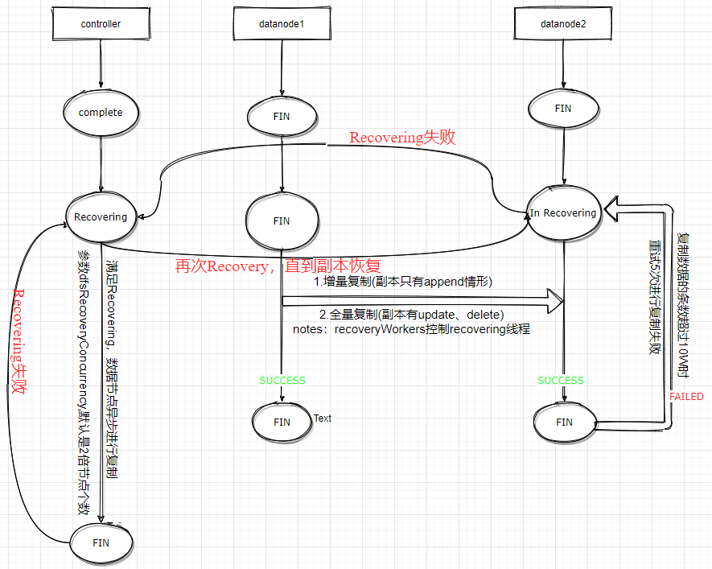

# DolphinDB教程：数据库 Recovery

在使用DolphinDB时，当有副本产生永久性损坏或者宕机节点的副本损坏，可以使用 Online Recovery 功能进行数据恢复。 

- [DolphinDB教程：数据库 Recovery](#dolphindb教程数据库-recovery)
  - [1. Recovery 功能说明](#1-recovery 功能说明)
  - [2. Recovery 流程](#2-recovery 流程)
  - [3. 常见问题与解决方案](#3-常见问题与解决方案)
  - [4. 总结](#4-总结)

## 1. Recovery 功能说明

​	在 DolphinDB 中，根据用户定义的多种副本规则，一份数据可能会同时存储在多个节点中，从而保证在单个或少数节点暂时离线或损坏时，读写数据不受任何影响。但是，当一个 集群 的多数或全部副本在短时间内全部下线时，为了保证数据的完整性，该 集群 会处于暂不可用的状态。

​	如果一段数据的副本发生了永久性损坏（如磁盘损坏）等问题，从而导致节点上线时，此段数据会一直保持暂不可用的状态。这时，如果用户希望集群恢复正常使用，DolphinDB 设计了 Recovery 机制修复损坏的副本，对于节点的元数据信息参阅  [repair_chunk_status.md · master · it / tutorials_cn · GitLab (dolphindb.net)](https://dolphindb.net/dolphindb/tutorials_cn/-/blob/master/repair_chunk_status.md) ，对于下面介绍五种情况触发 Recovery 机制:

- 数据节点（Datanode） 启动后，首先会汇报所有的 分区（chunk）给 控制节点（Controller），如果Controller发现 chunk 的版本号比自己低，那么触发 Recovery；

- 运行过程中，在读数据的时候，如果检测到有的列的checksum不正确，说明数据被破坏了（比如磁盘有坏道），那么datanode直接汇报该 corruption的chunk，需要recovery；

- 运行过程中，由于网络不稳定，Controller 多次没收到 Datanode 心跳，于是认为 Datanode 宕机了，会把副本都删掉。当网络恢复，Datanode 再次汇报chunk ，可能检测到版本不一致，发起 Recovery；

- Raft 高可用模式，由于网络不稳定，Leader 发生切换，新的 Leader会要求所有的 Datanode 汇报 Chunk。当汇报的 Chunk 检测到版本不一致的时候，发起Recovery；

- 如果 Controller 收到的副本个数小于配置的副本个数，那么超过设定的时间后（DFSRecoveryWaitingTime）后，会将副本在新的节点上重建，该选项默认配置最最大值，就是不会开启这个复制；

  > 注意 ！！！
  >
  > 1、dfsRecoveryWaitTime 这个参数用户容易误设，比如设置成0，那系统就非常危险。所以，禁止更改这个参数的设置，不开启。
  >
  > 2、假设高可用模式下，网络不稳定，切换 Leader 频繁，可以修改两个参数：一个是 controller.cfg 中 raftElectionTick 参数 确定一个时间区间（单位为10ms）：[*raftElectionTick*, 2 * *raftElectionTick*]。follower 在收到上一个心跳后，经过该区间内一个随机时刻之后仍然没有收到 leader 的心跳，则会发出竞选 Leader 的请求。默认值为800，即8s，确定的时间区间为[8s, 16s]。注意：需要保持 raft 组内所有控制节点的配置一致，另外一个是 修改 cluster.cfg 中 dfsChunkNodeHeartBeatTimeout， 控制节点判断数据节点是否在线的超时时间（单位为秒）。若超过该设置值，控制节点仍未收到数据节点的心跳，则认为该数据节点已宕机。


## 2. Recovery 流程



Recovery 是由 Controller 推动整个流程，因为 Controller 上有所有副本的信息，知道哪些副本版本正确,流程图见上图；

1、Controller收到 Datanode 的汇报后，不管是由于data corruption还是版本号不一致，都需要进行恢复，放入到待恢复队列，并且把 chunk 状态设置为Recovering，此时不允许写入；

2、根据目前已经收到的汇报，选择确定恢复的源节点和目的节点，向源节点发起 Recovery 任务；

3、源节点收到任务后，开始从源节点到目的节点的恢复，并且每隔30秒向 Controller 发送恢复任务心跳；

4、源节点恢复任务完成后，向 Controller 发送完成状态；

5、Controller 收到源节点汇报的完成报告，更新 副本（Replica） 状态信息，将 Replica设置为可用状态，允许写入；如果收到恢复失败的情况，Controller 会重试，目前最多重试5次；

## 3. 常见问题与解决方案

- Recovery 过程中，可以读写分区数据吗？

  目前在 1.30.16 推出 online Recovery 机制。允许 Recovery 读写该分区的数据

- 如何提高 Recovery并发度，目前默认的 Recovery 线程是多少？

  在 **controller.cfg** 中设置 **dfsRecoveryConcurrency**，并发执行 Recovery 任务的个数，默认是除 agent 节点外所有节点个数的2倍。

  在 **cluster.cfg** 中设置 **recoveryWorkers** ，节点恢复时，可以用于同步恢复 chunk 的工作线程数。默认值是1。

- 如何查看系统 Recovery的进度，以及预估完成时间？

  执行一下命令，查看 Recovery 的进度：

  ```shell
  $ getRecoveryTaskStatus()
  ```

  - 参数：无

  - 返回值：一个 `table`

  - `TaskId`：Recovery 任务的 id，每个 Recovery 任务唯一id；

  - `TaskType`:两种类型 ChunkRecovery 和 LoadRebalance。两种的区别是，由版本不一致或者数据破坏而导致的复制操作为 ChunkRecovery，由moveReplica/copyReplica 触发的为 LoadRebalance；

  - `ChunkId`：chunk id；

  - `ChunkPath`：chunk path；

  - `Source`：源节点的别名；

  - `Dest`：目的节点的别名；

  - `Status`：状态

  - `AttemptCount`：本次 Recovery 任务重试次数；

  - `DeleteSource`：是否删除源节点 replica；

  - `StartTime`：任务开始时间；
    `FinishTime`：任务结束时间；

  - `LastDequeueTime`：任务从 Controller的等待队列出队时间，如果重试多次，则是最后一次的出队时间；

  - `LastStartTime`：任务出队后，如果有空闲的 worker 则开始执行，表示最后一次开始执行的时间;

  - `IsIncrementalRecovery`：是否是增量 Recovery；

  - `IsAsyncRecovery`：当前是否是异步 Recovery 阶段，或者同步 Recovery 阶段；

  - `changeFromIncrementalToFull`：是否转为全量复制，如果重试多次增量 Recovery 失败后，则转换为同步全量复制；

  - `ChangeToSyncTime`：任务由异步 Recovery 转换为同步 Recovery 的时间；

    > 注意：该函数在controller上执行，获取整个recovery的任务状态。改状态会保留最近1天或者1万条记录；便于定位问题或者性能调优；可以看到出于IRE以及RE状态有多少个，同时并行的为 2*数据节点个数。

- 数据处于全天实时写入，处于 Recovery 的副本会影响实施写入业务，有什么方法暂时关闭 Recovery？

  在版本1.30.16以及2.00.4 执行以下函数，停止以及开启 Recovery 的功能:

  ```shell
  $ suspendRecovery（）
  ```

  - 用于暂停在线恢复节点的进程。恢复进程中，处于 "In-Progress" 状态的数据会继续恢复，"Waiting" 状态的数据会暂停恢复。暂停后，恢复进程的源节点可以继续写入数据。
   ```shell
  $ resumeRecovery()
  ```
  - 用于重启节点恢复的进程。调用该命令后，会继续恢复 "Waiting" 状态的数据。

> 注意：上述两个命令启用高可用集群时，需要在 raft 组内每个节点执行该命令。

- 假设客户只有单副本，有什么办法解决这种情况？

  参考 [repair_chunk_status.md · master · it / tutorials_cn · GitLab (dolphindb.net)](https://dolphindb.net/dolphindb/tutorials_cn/-/blob/master/repair_chunk_status.md) 4.1小节。

- 假设客户有2个副本的配置，实际只有一个 chunk，无法发起 Recovering。

  执行以下函数复制副本：

  ```shell
  $ copyReplicas(srcNode, destNode, chunkId)    
  ```

  - 返回值：无
  - 该函数在 Controller上执行，将 chunkId 由源节点复制到目的节点上，转移过程中不能写入（处于Recovery状态）。如果目的节点上已经存在该分区，则覆盖原来的数据。如果不存在，创建该分区。整个过程可以任务是事务的，不会出现中间状态

## 4. 总结

分布式数据库DolphinDB的设计十分复杂，发生 Recovery 的情况各有不同。若发生节点 Recovery，请参照本文第三节场景进行处理，若确定系统有问题，请保存节点日志、操作系统日志，并及时与DolphinDB工程师联系。
