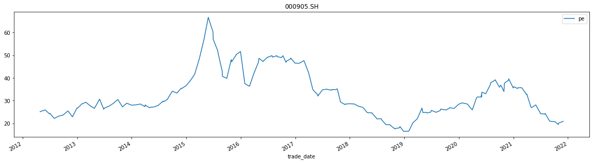

Dolphindb 的python API教程参考[dolphindb/api_python3](https://gitee.com/dolphindb/api_python3)
本文档为python使用dolphindb数据库的简单实例。通过python语言创建dolphindb数据库和表，以及提取dolphindb表中的数据等，进一步了解dolphindb数据库的使用。
- [1. 创建数据库](#1-创建数据库)
- [2. 创建表](#2-创建表)
  - [通过run方法，指定表名、列名和相应的数据类型以及分区列在已经创建的数据库中创建一个空表。](#通过run方法指定表名列名和相应的数据类型以及分区列在已经创建的数据库中创建一个空表)
  - [通过run方法，使用upload上传本地DataFrame创建一个空表](#通过run方法使用upload上传本地dataframe创建一个空表)
- [3. 数据导入](#3-数据导入)
  - [通过run方法，调用loadTextEx指定schema参数的方式导入csv文件](#通过run方法调用loadtextex指定schema参数的方式导入csv文件)
  - [通过Python api的tableAppender的append方法导入pandas DataFrame数据](#通过python-api的tableappender的append方法导入pandas-dataframe数据)
  - [通过tableInsert的方法导入pandas DataFrame数据](#通过tableinsert的方法导入pandas-dataframe数据)
- [4. 更新表中的数据](#4-更新表中的数据)
- [5. 提取表中的数据](#5-提取表中的数据)
- [6. 实例——计算指数估值因子pe，pb](#6-实例计算指数估值因子pepb)
  - [创建数据库和表](#创建数据库和表)
  - [数据导入到相应的库表中](#数据导入到相应的库表中)
  - [从dolphindb库表中提取相应的数据并进行分析计算](#从dolphindb库表中提取相应的数据并进行分析计算)
  - [沪深300，中证500，中证1000估值指标pe结果展示](#沪深300中证500中证1000估值指标pe结果展示)
# 1. 创建数据库
在Python API中创建DolphinDB数据库可以使用DolphinDB Python API的原生方法或run方法。创建数据库及数据表时，分区方式有VALUE、RANGE、LIST、HASH和COMPO五种。如对如下数据，可以创建交易日按值、标的代码按哈希分区的复合类型的的分布式数据库和表存储数据。通过指定数据库路径，分区类型，分区方案，数据库名称创建数据库，当数据库路径为空时创建的内存数据库。
创建数据库路径为"dfs://case1"，交易日按值、标的代码哈希分区的复合分区的分布式数据库
```python
dbPath = "dfs://case1"
if not s.existsDatabase(dbPath):
    dbSymbol = s.database("db2", keys.HASH, [keys.DT_SYMBOL, 20], dbPath="")
    dbday = s.database("db1", keys.VALUE, "2010.01.01..2030.12.01", dbPath="")
    DB = s.database(dbName='case1', partitionType=keys.COMPO, partitions=[dbday, dbSymbol],
    dbPath=dbPath)
```

# 2. 创建表
创建完数据库之后，可以在当前数据库中创建多个分区表，表的分区类型和数据库的分区类型一致。
## 通过run方法，指定表名、列名和相应的数据类型以及分区列在已经创建的数据库中创建一个空表。
```python
def createPartitionedTable_by_columns(dbPath=None, tableName=None, columns=None, columnsType=None,partitionColumns=None):
    """
    通过指定表名、列和列的类型、分区列、创建一个空表
    :param dbPath:
    :param tableName:
    :param columns:  ['code', 'datetime', 'price']
    :param columnsType: [keys.DT_SYMBOL, keys.DT_DATETIME,keys.DT_FLOAT]
    :param partitionColumns:['code', 'datetime']
    :return:
    """
    if not s.existsDatabase(dbPath):
        print("Database {} does not exist".format(dbPath))
        return
    if not s.existsTable(dbPath, tableName):
        s.run("tb=table(100:0,`{}, {})".format('`'.join(columns), columnsType))
        s.run("""dbt=database("{}")""".format(dbPath))
        s.run("""t=dbt.createPartitionedTable(tb,"{}",`{})""".format(tableName, '`'.join(partitionColumns)))
tableName = 'test1'
partitionColumns = ['Date', 'symbol']
columns = ['symbol', 'DateTime', 'Date', 'Time', 'ask1', 'ask2', 'ask3', 'ask4', 'ask5', 'bid1', 'bid2',
'bid3', 'bid4', 'bid5', 'asize1', 'asize2', 'asize3', 'asize4',
'asize5', 'bsize1', 'bsize2', 'bsize3', 'bsize4', 'bsize5']
columnsType = [keys.DT_SYMBOL, keys.DT_NANOTIMESTAMP, keys.DT_DATE, keys.DT_NANOTIME, keys.DT_FLOAT,
keys.DT_FLOAT,
keys.DT_FLOAT, keys.DT_FLOAT, keys.DT_FLOAT, keys.DT_FLOAT, keys.DT_FLOAT, keys.DT_FLOAT,
keys.DT_FLOAT, keys.DT_FLOAT, keys.DT_LONG, keys.DT_LONG,
keys.DT_LONG, keys.DT_LONG, keys.DT_LONG, keys.DT_LONG, keys.DT_LONG, keys.DT_LONG,
keys.DT_LONG,
keys.DT_LONG]
createPartitionedTable_by_columns(dbPath=dbPath, tableName=tableName, columns=columns, columnsType=columnsType,
partitionColumns=partitionColumns)
print(s.loadTable(tableName=tableName, dbPath=dbPath).schema)
#output
name     typeString  typeInt comment
0     symbol         SYMBOL       17 
1   DateTime  NANOTIMESTAMP       14 
2       Date           DATE        6 
3       Time       NANOTIME       13 
4       ask1          FLOAT       15 
5       ask2          FLOAT       15 
6       ask3          FLOAT       15 
7       ask4          FLOAT       15 
8       ask5          FLOAT       15 
9       bid1          FLOAT       15 
10      bid2          FLOAT       15 
11      bid3          FLOAT       15 
12      bid4          FLOAT       15 
13      bid5          FLOAT       15 
14    asize1           LONG        5 
15    asize2           LONG        5 
16    asize3           LONG        5 
17    asize4           LONG        5 
18    asize5           LONG        5 
19    bsize1           LONG        5 
20    bsize2           LONG        5 
21    bsize3           LONG        5 
22    bsize4           LONG        5 
23    bsize5           LONG        5 
```
## 通过run方法，使用upload上传本地DataFrame创建一个空表
当数据的列数比较多时，可以通过pandas读取一个样例文件，通过upload上传本地DataFrame到服务器，再修改相应的数据类型，通过run方法调用createPartitionedTable通过样例数据创建一个空表
```python
 def create_table_by_df(dbPath=None, tableName=None, partitionColumns=None):
    """
    通过pandas读取一个样例文件，通过样例数据创建一个空表
    
    :param dbPath:
    :param tableName:
    :return:NANOTIMESTAMP
    """
    dataPath = "D://work//data//stock//test//second//20191212.csv"
    
    colfloat = ['ask1', 'ask2', 'ask3', 'ask4', 'ask5', 'bid1', 'bid2', 'bid3', 'bid4', 'bid5']
    colint = ['asize1', 'asize2', 'asize3', 'asize4', 'asize5', 'bsize1', 'bsize2', 'bsize3', 'bsize4', 'bsize5']
    cols = ['ask1', 'ask2', 'ask3', 'ask4', 'ask5', 'bid1', 'bid2',
    'bid3', 'bid4', 'bid5', 'asize1', 'asize2', 'asize3', 'asize4',
    'asize5', 'bsize1', 'bsize2', 'bsize3', 'bsize4', 'bsize5']
    df = pd.read_csv(dataPath, encoding='utf-8')
    df['symbol'] = df['symbol'].astype(str)
    to_datetime64_for_df(df, ['DateTime', 'Date'])
    df['Time'] = df['Time'].apply(lambda x: datetime.strptime(str(x), "%H:%M:%S.%f"))
    df[colfloat] = df[colfloat].astype('float32')
    df[colint] = df[colint].astype('int64')
    s.upload({"newdf": df})
    s.run("""dbt=database("{}")""".format(dbPath))
    s.run(
    """newdf=select symbol(symbol) as symbol,nanotimestamp(DateTime) as DateTime,date(Date) as Date,nanotime(Time) as Time ,{} from newdf""".format(
    ','.join(cols)))
    s.run("""t=dbt.createPartitionedTable(newdf,"{}",`{})""".format(tableName, '`'.join(partitionColumns)))
```
# 3. 数据导入
## 通过run方法，调用loadTextEx指定schema参数的方式导入csv文件
当DolphinDB加载数据文件时，会进行随机抽样，并基于样本决定每列的数据类型。这个方法不一定每次都能准确决定各列的数据类型。因此我们建议，在加载数据前，可以使用schema指定所有数据类型。
```python
def import_csv_to_dolphindb(dbPath=None, tableName=None, partitionColumns=None, csvFile=None):
    """
        通过调用dolphindb中的loadTextEx函数,设定函数中的schema来导入数据
    
    :param dbPath:
    :param tableName:
    :param partitionColumns:
    :param csvFile:
    :return:
    """
    s.run(
    """schema_=select name,typeString as type from  loadTable("{}","{}").schema().colDefs""".format(dbPath,
    tableName))
    s.run("""db=database("{}")""".format(dbPath))
    csvFile_list = csvFile if isinstance(csvFile, list) else [csvFile]
    for ifile in csvFile_list:
    s.run(
    """loadTextEx(dbHandle=db,tableName=`{},partitionColumns=`{},filename="{}",schema=schema_)""".format(
    tableName,'`'.join(partitionColumns),ifile))

dataPath = "D://work//data//stock//test//second"
allFiles = glob.glob(dataPath + "//*.csv")
allFiles = [ipath.replace('\\', '//') for ipath in allFiles]
import_csv_to_dolphindb(dbPath=dbPath, tableName=tableName, partitionColumns=['DateTime', 'symbol'], csvFile=allFiles)
```
## 通过Python api的tableAppender的append方法导入pandas DataFrame数据
Python API提供了tableAppender对象，通过append方法往内存表或者分布式表添加本地的DataFrame数据时，能够自动对时间类型进行转换，不需要用户手动转换。但是该方法上传含空值的整数型数据类型时无法自动转换，需要先把DataFrame整型列的空值进行填充。
```python 
def import_df_to_dolphindb_tableAppender(dbPath=None, tableName=None, allFiles=None):
    """
    本例为利用tableAppender把文件通过DataFrame加载到数据表中的样例;
    通过tableAppender导入数据,使用tableAppender对象追加数据时自动转换时间类型,
    但是其他的数据类型转换需要在python中显示转换为相应的类型,
    如表中存储为int, 则在python端需要显示转化为int32
    如表中存储为long, 则在python端需要显示转化为int64
    :param dbPath:
    :param tableName:
    :param  allFiles:
    """
    ###2.通过tableAppender导入数据,使用tableAppender对象追加数据时自动转换时间类型
    colfloat = ['ask1', 'ask2', 'ask3', 'ask4', 'ask5', 'bid1', 'bid2', 'bid3', 'bid4', 'bid5']
    colint = ['asize1', 'asize2', 'asize3', 'asize4', 'asize5', 'bsize1', 'bsize2', 'bsize3', 'bsize4', 'bsize5']
    # # #
    Appender = ddb.tableAppender(dbPath=dbPath, tableName=tableName, ddbSession=s, action="fitColumnType")
    for ifile in allFiles:
        df = pd.read_csv(ifile, encoding='utf-8')
        df['symbol'] = df['symbol'].astype(str)
        to_datetime64_for_df(df, ['DateTime', 'Date'])
        df['Time'] = df['Time'].apply(lambda x: datetime.strptime(str(x), "%H:%M:%S.%f"))
        df[colfloat] = df[colfloat].astype('float32')
        df[colint] = df[colint].fillna(0).astype('int64')
        Appender.append(df)
dataPath = "D://work//data//stock//test//second"
allFiles = glob.glob(dataPath + "//*.csv")
allFiles = [ipath.replace('\\', '//') for ipath in allFiles]
```
## 通过tableInsert的方法导入pandas DataFrame数据
把DataFrame通过uplaod方法上传到服务器，对时间类型及相应的数据类型进行转换，再调用tableInsert导入表中
```python
def import_df_to_dolphindb_tableInsert( dbPath=None, tableName=None, allFiles=None):
    """
    通过tableInsert追加数据,使用tableInsert需要转换时间和int类型数据
    :param dbPath:
    :param tableName:
    :param allFiles:
    :return:
    """
    cols = ['ask1', 'ask2', 'ask3', 'ask4', 'ask5', 'bid1', 'bid2',
    'bid3', 'bid4', 'bid5', 'long(asize1)', 'long(asize2)', 'long(asize3)', 'long(asize4)',
    'long(asize5)', 'long(bsize1)', 'long(bsize2)', 'long(bsize3)', 'long(bsize4)', 'long(bsize5)']
    s.run("tb=loadTable('{db}', `{tb})".format(db=dbPath, tb=tableName))
    for ifile in allFiles:
        df = pd.read_csv(ifile, encoding='utf-8')
        to_datetime64_for_df(df, ['DateTime', 'Date'])
        df['Time'] = df['Time'].apply(lambda x: datetime.strptime(str(x), "%H:%M:%S.%f"))
        s.upload({"df": df})
        s.run(
        """df=select symbol(symbol) as symbol,nanotimestamp(DateTime) as DateTime,date(Date) as Date,nanotime(Time) as Time ,{} from df""".format(
        ','.join(cols)))
        s.run("tableInsert(tb,df)")
```
# 4. 更新表中的数据
通过run调用upsert!函数将新数据写入索引内存表、键值内存表，或者DFS表
```python
def upsert():
    """
    更新新的数据到表中,如20191213日的数据需要更新
    :return:
    """
    dbPath = "dfs://case1"
    tableName = 'test1'
    dataPath = "D://work//data//stock//test//second//20191213.csv"
    colfloat = ['ask1', 'ask2', 'ask3', 'ask4', 'ask5', 'bid1', 'bid2', 'bid3', 'bid4', 'bid5']
    cols = ['ask1', 'ask2', 'ask3', 'ask4', 'ask5', 'bid1', 'bid2',
    'bid3', 'bid4', 'bid5', 'long(asize1)', 'long(asize2)', 'long(asize3)', 'long(asize4)',
    'long(asize5)', 'long(bsize1)', 'long(bsize2)', 'long(bsize3)', 'long(bsize4)', 'long(bsize5)']
    partitionColumns = ['DateTime', 'symbol']
    s.run("tb=loadTable('{db}', `{tb})".format(db=dbPath, tb=tableName))
    df = pd.read_csv(dataPath, encoding='utf-8')
    to_datetime64_for_df(df, ['DateTime', 'Date'])
    df['Time'] = df['Time'].apply(lambda x: datetime.strptime(str(x), "%H:%M:%S.%f"))
    df[colfloat] = df[colfloat].astype('float32')
    df['asize1'] = df['asize1'] * 100000
    s.upload({"newdf": df})
    s.run(
    """newdf=select symbol(symbol) as symbol,nanotimestamp(DateTime) as DateTime,date(Date) as Date,nanotime(Time) as Time ,{} from newdf""".format(
    ','.join(cols)))
    s.run("upsert!(tb,newdf,,`{})".format('`'.join(partitionColumns)))
```
# 5. 提取表中的数据
DolphinDB提供了灵活的方法来生成SQL语句。通过调用select，where等条件查询数据
```python
def select_data(self, dbPath, tableName, columns=None, begt="", endt=""):
    """
    
    :param dbPath:
    :param tableName:
    :param columns:
    :param begt:
    :param endt:
    :return:
    """
    tb = s.loadTable(tableName=tableName, dbPath=dbPath)
    columns = columns if isinstance(columns, list) else [columns]
    df = tb.select(columns).where("Date<{}".format(endt)).where("Date>{}".format(begt)).toDF()
    return df
```
# 6. 实例——计算指数估值因子pe，pb
## 创建数据库和表
计算A股重要指数沪深300，中证500，中证1000的2010年以来的估值指标市盈率pe，市净率pb。首先需要的是指数的成分股信息，成分股的收盘价数据，成分股的总股本数据，财务指标的每季度净利润和归属于母公司的权益等数据。指数成分股数据暂时只拿到每月初和月末的成分股数据。
首先创建存放股票财务数据的数据库"dfs://stockfinaDB"，存放股票日频数据的数据库"dfs://stockdaily"
```python
def create_stock_fina_DB(dbPath="dfs://stockfinaDB"):
    """
    创建存储股票财务数据的数据库，交易所分区的
    :return:
    """
    if not s.existsDatabase(dbPath):
    # 创建数据库
        stockfinaDB = s.database(dbName='stockfinaDB', partitionType=keys.LIST, partitions=['SH', 'SZ', 'BJ'],
        dbPath=dbPath)


def create_stock_daily_DB(dbPath="dfs://stockdaily"):
    """
    创建存储股票日线数据的数据库,与年和交易所进行分区
    :return:
    """
    if not s.existsDatabase(dbPath):
        # # 创建数据库
        dbDate = s.database("db1", keys.RANGE,
        partitions=np.array(pd.date_range("20100101", '20300101', freq='AS'),
        dtype='datetime64[D]'),
        dbPath="")
        dbSymbol = s.database("db2", keys.LIST, ['SH', 'SZ', 'BJ'], dbPath="")
        DB = s.database(dbName='pystockdaily', partitionType=keys.COMPO, partitions=[dbDate, dbSymbol],
        dbPath=dbPath)
```
把利润表数据和资产负债表数据存放在财务数据库"dfs://stockfinaDB"中，把指数成分股数据，存放每日总股本的每日指标数据表和股票的每日行情数据表存放在数据库"dfs://stockdaily"中，以下代码为创建相应的空表
```python
dbPath1 = "dfs://stockfinaDB"
create_stock_fina_DB(dbPath=dbPath1)
dbPath2 = "dfs://stockdaily"
create_stock_daily_DB(dbPath=dbPath2)

# ### create table
tableName = "debtassets"
dbPath = "dfs://stockfinaDB"
columns = ['ts_code', 'ann_date', 'f_ann_date', 'end_date', 'undistr_porfit', 'money_cap', 'trad_asset',
'notes_receiv', 'accounts_receiv', 'inventories',
'total_cur_assets', 'fix_assets', 'goodwill', 'total_assets', 'total_cur_liab', 'total_liab',
'minority_int', 'total_nca', 'total_hldr_eqy_exc_min_int', 'total_hldr_eqy_inc_min_int',
'total_liab_hldr_eqy', 'exchange_code']
columnsType = [keys.DT_SYMBOL, keys.DT_DATE, keys.DT_DATE, keys.DT_DATE, keys.DT_DOUBLE, keys.DT_DOUBLE,
keys.DT_DOUBLE, keys.DT_DOUBLE, keys.DT_DOUBLE, keys.DT_DOUBLE, keys.DT_DOUBLE, keys.DT_DOUBLE,
keys.DT_DOUBLE, keys.DT_DOUBLE, keys.DT_DOUBLE, keys.DT_DOUBLE, keys.DT_DOUBLE, keys.DT_DOUBLE,
keys.DT_DOUBLE, keys.DT_DOUBLE, keys.DT_DOUBLE, keys.DT_SYMBOL]
partitionColumns = ['exchange_code']
createPartitionedTable_by_columns(dbPath, tableName, columns, columnsType, partitionColumns)

### create table
tableName = "profit"
dbPath = "dfs://stockfinaDB"
columns = ['ts_code', 'ann_date', 'f_ann_date', 'end_date', 'total_revenue', 'revenue', 'total_cogs',
'oper_exp', 'operate_profit', 'n_income', 'n_income_attr_p', 'minority_gain', 'compr_inc_attr_p',
'compr_inc_attr_m_s', 'undist_profit', 'total_profit', 'exchange_code']
columnsType = [keys.DT_SYMBOL, keys.DT_DATE, keys.DT_DATE, keys.DT_DATE,
keys.DT_DOUBLE, keys.DT_DOUBLE, keys.DT_DOUBLE, keys.DT_DOUBLE, keys.DT_DOUBLE, keys.DT_DOUBLE,
keys.DT_DOUBLE, keys.DT_DOUBLE, keys.DT_DOUBLE,
keys.DT_DOUBLE, keys.DT_DOUBLE, keys.DT_DOUBLE, keys.DT_SYMBOL]
partitionColumns = ['exchange_code']
createPartitionedTable_by_columns(dbPath, tableName, columns, columnsType, partitionColumns)

### create table
tableName = "daily_basic"
dbPath = "dfs://stockdaily"

columns = ['ts_code', 'trade_date', 'close', 'turnover_rate', 'volume_ratio', 'pe', 'pb', 'total_share', 'float_share',
'free_share', 'exchange_code']
columnsType = [keys.DT_SYMBOL, keys.DT_DATE, keys.DT_FLOAT, keys.DT_FLOAT, keys.DT_FLOAT, keys.DT_FLOAT, keys.DT_FLOAT,
keys.DT_LONG, keys.DT_LONG, keys.DT_LONG, keys.DT_SYMBOL]
partitionColumns = ['trade_date', 'exchange_code']
createPartitionedTable_by_columns(dbPath, tableName, columns, columnsType, partitionColumns)

### create table
tableName = "daily"
dbPath = "dfs://stockdaily"
columns = ['ts_code', 'trade_date', 'open', 'high', 'low', 'close', 'pre_close',
'change', 'pct_chg', 'vol', 'amount', 'exchange_code', 'adj_factor']
columnsType = [keys.DT_SYMBOL, keys.DT_DATE, keys.DT_FLOAT, keys.DT_FLOAT, keys.DT_FLOAT, keys.DT_FLOAT, keys.DT_FLOAT,
keys.DT_FLOAT, keys.DT_FLOAT, keys.DT_LONG, keys.DT_DOUBLE, keys.DT_SYMBOL, keys.DT_FLOAT]
partitionColumns = ['trade_date', 'exchange_code']
createPartitionedTable_by_columns(dbPath, tableName, columns, columnsType, partitionColumns)

### create table

tableName = "index_weight"
dbPath = "dfs://stockdaily"
# s.dropTable(dbPath, tableName)
columns = ['index_code', 'ts_code', 'trade_date', 'weight', 'exchange_code']
columnsType = [keys.DT_SYMBOL, keys.DT_SYMBOL, keys.DT_DATE, keys.DT_FLOAT, keys.DT_SYMBOL]
partitionColumns = ['trade_date', 'exchange_code']
createPartitionedTable_by_columns(dbPath, tableName, columns, columnsType, partitionColumns)
```
## 数据导入到相应的库表中
假设所有的数据都存放在csv文件中，通过提取相应数据集中的数据文件导入数据到相应的库表中
```python
def get_all_csvfiles(Path=None):
    """
    获取路径下所有的csv文件
    :param dataPath:
    :return:
    """
    allFiles = glob.glob(Path + "*.csv")
    allFiles = [ipath.replace('\\', '//') for ipath in allFiles]
    return allFiles
def import_debtassets_to_dolphindb():
    """
    
    :return:
    """
    ###import debtassets
    tableName = "debtassets"
    dbPath = "dfs://stockfinaDB"
    partitionColumns = ['exchange_code']
    dataPath = "D://work//data//stock//debtassets//"
    allFiles = get_all_csvfiles(Path=dataPath)
    print("导入{}数据开始：{}".format(tableName, datetime.now()))
    import_csv_to_dolphindb(dbPath=dbPath, tableName=tableName, partitionColumns=partitionColumns, csvFile=allFiles)
    print("导入{}数据结束：{}".format(tableName, datetime.now()))


def import_profit_to_dolphindb():
    """
    
    
    :return:
    """
    tableName = "profit"
    dbPath = "dfs://stockfinaDB"
    partitionColumns = ['exchange_code']
    dataPath = "D://work//data//stock//profit//"
    allFiles = get_all_csvfiles(dataPath)
    print("导入{}数据开始：{}".format(tableName, datetime.now()))
    import_csv_to_dolphindb(dbPath=dbPath, tableName=tableName, partitionColumns=partitionColumns, csvFile=allFiles)
    print("导入{}数据结束：{}".format(tableName, datetime.now()))


def import_daily_basic_to_dolphindb():
    """
    
    :return:
    """
    tableName = "daily_basic"
    dbPath = "dfs://stockdaily"
    partitionColumns = ['trade_date', 'exchange_code']
    dataPath = "D://work//data//stock//daily_basic//"
    allFiles = get_all_csvfiles(dataPath)
    print("导入{}数据开始：{}".format(tableName, datetime.now()))
    import_csv_to_dolphindb(dbPath=dbPath, tableName=tableName, partitionColumns=partitionColumns, csvFile=allFiles)
    print("导入{}数据结束：{}".format(tableName, datetime.now()))
def import_stock_daily_to_dolphindb():
    """
    
    :return:
    """
    tableName = "daily"
    dbPath = "dfs://stockdaily"
    partitionColumns = ['trade_date', 'exchange_code']
    dataPath = "D://work//data//stock//daily//"
    allFiles = get_all_csvfiles(dataPath)
    print("导入{}数据开始：{}".format(tableName, datetime.now()))
    import_csv_to_dolphindb(dbPath=dbPath, tableName=tableName, partitionColumns=partitionColumns, csvFile=allFiles)
    print("导入{}数据结束：{}".format(tableName, datetime.now()))


def import_index_weight_to_dolphindb():
    """
    
    :return:
    """
    tableName = "index_weight"
    dbPath = "dfs://stockdaily"
    partitionColumns = ['trade_date', 'exchange_code']
    dataPath = "D://work//data//stock//index_weight//"
    allFiles = get_all_csvfiles(dataPath)
    print("导入{}数据开始：{}".format(tableName, datetime.now()))
    import_csv_to_dolphindb(dbPath=dbPath, tableName=tableName, partitionColumns=partitionColumns, csvFile=allFiles)
    print("导入{}数据结束：{}".format(tableName, datetime.now()))


if __name__ == '__main__':
    import_debtassets_to_dolphindb()
    import_profit_to_dolphindb()
    import_daily_basic_to_dolphindb()
    import_index_weight_to_dolphindb()
```
## 从dolphindb库表中提取相应的数据并进行分析计算
从dolphindb库表加载相应的数据，使用Python api中的loadTable函数加载相应的表，并用select和where等语句过滤相应的数据，以下为从指数成分表中提取沪深300，中证500，中证1000的成分股数据。从每日指标数据表中提取总股本数据。
```python
import pandas as pd
import tushare as ts
from datetime import datetime, date
from datetime import date, timedelta
import dolphindb as ddb
import pandas as pd
import numpy as np
import dolphindb.settings as keys
from datetime import datetime
s = ddb.session()
s.connect("127.0.0.1", 22214, "admin", "123456")
dbPath1="dfs://stockdaily"
tableName = "index_weight"
index_codes=['000300.SH',  '000905.SH',  '000852.SH']
indexcondf = s.loadTable(tableName="index_weight", dbPath=dbPath1).toDF()
indexcondf=indexcondf[['index_code','ts_code','trade_date','weight']]
trade_dates=list(set(indexcondf.trade_date.tolist()))
codes=list(set(indexcondf.ts_code.tolist()))
trade_datesstr=[idate.strftime("%Y.%m.%d") for idate in trade_dates]
indexcondf=indexcondf[indexcondf.index_code.isin(index_codes)]
cols=['ts_code', 'trade_date', 'close','total_share']
tb= s.loadTable(tableName="daily_basic", dbPath=dbPath1)
basicdf=tb.select(cols).where("trade_date in [{}]".format(','.join(trade_datesstr))).where("ts_code in `{}".format("`".join(codes))).toDF()
```
提取收盘价数据，同时进行数据处理，当日标的停牌时的收盘价为上一交易日的收盘价
```python
#查询出停牌时需要填充的数据
df=basicdf.merge(indexcondf,on=['trade_date','ts_code'],how='left')
# dfnan=df[df.isnull().T.any()]
codeslist=["""_"{}\"""".format(icode)for icode in set(df.ts_code.tolist())]
codeslist.insert(0,'date')
df=df.sort_values(['trade_date'])
df=df.groupby('ts_code').apply(lambda x:x.fillna(method='ffill').fillna(method='bfill'))
df=df[['trade_date','ts_code','index_code','weight','total_share']]

#在日线数据表中查找收盘价对表进行填
stockdailydf=s.loadTable("close","dfs://shengquan_stockdaily").select(codeslist).toDF()
stockdailydf=stockdailydf.set_index('date').stack(dropna=True).reset_index()
stockdailydf.columns=['trade_date','ts_code','close']
stockdailydf=stockdailydf.sort_values(['trade_date'])
df=pd.merge_asof(stockdailydf,df,on='trade_date',by='ts_code')
df=df.groupby('ts_code').apply(lambda x:x.fillna(method='ffill').fillna(method='bfill'))
df=df[df.trade_date.isin(trade_dates)]
```
提取财务数据，提取净利润和归属于母公司的权益数据，并计算净利润ttm。提取利润表并计算ttm耗时0:00:13.976623。
```python
cols = ['ts_code', 'ann_date', 'f_ann_date', 'end_date', 'total_hldr_eqy_exc_min_int']
tb = s.loadTable(tableName="debtassets", dbPath="dfs://stockfinaDB")
debtdf = tb.select(cols).where("ts_code in `{}".format("`".join(codes))).toDF().drop_duplicates(subset=['ts_code', 'ann_date', 'f_ann_date', 'end_date'])
debtdf = debtdf.rename(columns={'f_ann_date': 'trade_date'})
debtdf = debtdf[['ts_code', 'trade_date', 'total_hldr_eqy_exc_min_int']].sort_values(['trade_date'])
begt = datetime.now()
cols = ['ts_code', 'ann_date', 'f_ann_date', 'end_date', 'n_income_attr_p']
tb = s.loadTable(tableName="profit", dbPath="dfs://stockfinaDB")
profitdf = tb.select(cols).where("ts_code in `{}".format("`".join(codes))).toDF().drop_duplicates(
    subset=['ts_code', 'ann_date', 'f_ann_date', 'end_date'])
profitdf['last_year'] = profitdf['end_date'].apply(lambda x: pd.to_datetime(str(x.year - 1) + "-12-31"))
profitdf['last_pro'] = profitdf['end_date'].apply(lambda x: pd.to_datetime(date(x.year - 1, x.month, x.day)))
df1 = profitdf[['ts_code', 'end_date', 'n_income_attr_p']].rename(
    columns={'end_date': 'last_year', 'n_income_attr_p': 'last_year_n'})
df2 = profitdf[['ts_code', 'end_date', 'n_income_attr_p']].rename(
    columns={'end_date': 'last_pro', 'n_income_attr_p': 'last_pro_n'})
profitdf = profitdf.merge(df1, on=['ts_code', 'last_year'], how='left').merge(df2, on=['ts_code', 'last_pro'],
                                                                              how='left')
profitdf['ttm'] = profitdf.n_income_attr_p + profitdf.last_year_n - profitdf.last_pro_n
profitdf['ttm'] = profitdf['ttm'].fillna(profitdf['last_year_n'])
profitdf = profitdf.rename(columns={'f_ann_date': 'trade_date'})
print("提取利润表，并计算ttm值完成\n耗时：{}".format(datetime.now()-begt))
     #output
   # 0:00:13.976623
```
提取净利润表并计算净利润ttm直接用dolphindb运行耗时241ms,是pandas DataFrame计算速度的57倍。
```python
begt = datetime.now()
scripts="""
indexcon = loadTable("{}","index_weight")
codes=exec ts_code from indexcon
cols=['ts_code', 'ann_date', 'f_ann_date', 'end_date','n_income_attr_p']
tb=select ts_code, ann_date,f_ann_date,end_date,n_income_attr_p from loadTable("dfs://stockfinaDB","profit") where ts_code in codes
tb1=select ts_code, ann_date,f_ann_date,end_date,n_income_attr_p,date(string(year(end_date)-1)+".12.31") as last_year,date(string(year(end_date)-1)+end_date.format(".MM.dd")) as last_pro from tb
tb2=select ts_code, end_date as last_year,n_income_attr_p as last_year_n from tb
tb3=select ts_code, end_date as last_pro,n_income_attr_p as last_pro_n from tb
tb1=lj(tb1,tb2,['ts_code','last_year'])
tb1=lj(tb1,tb3,['ts_code','last_pro'])
tb1=select ts_code, ann_date,f_ann_date,end_date,n_income_attr_p,last_year_n,last_pro_n,n_income_attr_p+last_year_n-last_pro_n as ttm from tb1
update tb1 set ttm=ttm.nullFill(last_year_n);
""".format("dfs://stockdaily")
s.run(scripts)
print("通过脚本提取利润表，并计算ttm值完成\n耗时：{}".format(datetime.now() - begt))
#output
#提取利润表，并计算ttm值完成
#耗时：0:00:00.241355

```
## 沪深300，中证500，中证1000估值指标，pe结果展示
计算指数的估值指标pe，pb和roe。pe为成分股总市值除以成分股净利润ttm总和，pb为成分股总市值除以成分股归属于母公司的权益总和,roe为净利润ttm之和除以成分股归属于母公司的权益总和。
```python
ddf = pd.merge_asof(df, profitdf.sort_values(['trade_date']), on='trade_date', by='ts_code')
ddf = pd.merge_asof(ddf, debtdf.sort_values(['trade_date']), on='trade_date', by='ts_code')
ddf = ddf[ddf.trade_date > pd.to_datetime("2012-03-31")]
def f(x):
    dictt={}
    dictt['pe']=(x.close*x.total_share).sum()*10000./x.ttm.sum()
    dictt['pb']=(x.close*x.total_share).sum()*10000./x.n_income_attr_p.sum()
    dictt['roe'] = x.ttm.sum() / x.n_income_attr_p.sum()
    return pd.DataFrame([dictt])
ddf=ddf.groupby(['index_code','trade_date']).apply(f)
ddf=ddf.reset_index().replace(np.inf,np.nan)
ddf = ddf[['index_code', 'trade_date', 'pe', 'pb', 'roe']]
print(ddf.tail(50))
#output
  index_code trade_date         pe          pb       roe
505  000905.SH 2019-11-01  26.336171   27.487869  1.043731
506  000905.SH 2019-11-29  25.997840   27.134794  1.043733
507  000905.SH 2019-12-02  26.040864   27.179699  1.043733
508  000905.SH 2019-12-31  27.677100   29.707969  1.073377
509  000905.SH 2020-01-23  28.316716   30.374251  1.072662
510  000905.SH 2020-02-28  27.823005   30.070267  1.080770
511  000905.SH 2020-03-31  25.350190   25.998166  1.025561
512  000905.SH 2020-04-01  25.319018   25.811486  1.019451
513  000905.SH 2020-04-30  30.337008   77.679961  2.560568
514  000905.SH 2020-05-06  30.587419   77.130279  2.521634
515  000905.SH 2020-05-29  30.538299   79.698083  2.609775
516  000905.SH 2020-06-01  31.426022   80.446360  2.559865
517  000905.SH 2020-06-03  31.671356   78.162400  2.467921
for iindex_code in index_codes:
print(iindex_code)
ddf[ddf.index_code==iindex_code].set_index('trade_date')[['pe']].plot(title=iindex_code,figsize=(20,5))
```




