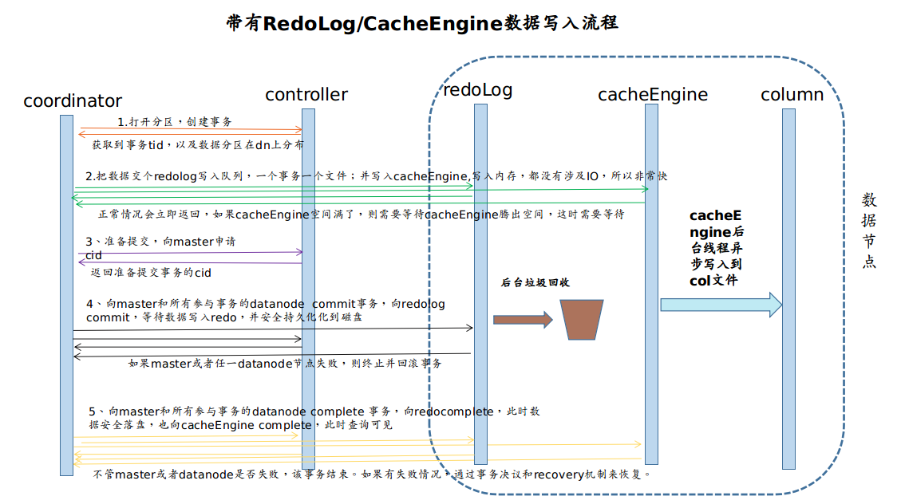

# redo log 和 cache engine：相关概念和配置说明

这篇教程重点介绍了 DolphinDB 中的 redo log 和 cache engine 机制、两者间的关系以及其配置对整体性能的影响。

需要注意的是，它们只对 DFS 数据库起作用，对磁盘表和流表不起作用。

注意：在 DolphinDB 中，若使用 TSDB 存储引擎必须开启 cache engine 和 redo log；使用 OLAP 存储引擎可以不开启 redo log，但启用了 redo log 之后必须启用 cache engine。

## 1. redo log

### 1.1 什么是 redo log

在关系型数据库系统中，预写式日志 (write-ahead logging, WAL) 是用于提供原子性和持久性的一系列技术。DolphinDB 中的 redo log 与 WAL 的概念类似。
简而言之，redo log 的核心思想是：只有在描述事务更改的日志记录刷新到持久化存储介质以后，才对数据库的数据文件进行修改。如果遵循这个过程，就不需要在每次提交事务时都将数据页刷新到磁盘上，因为在数据库发生宕机时，可以使用日志来恢复数据库，尚未应用的所有更改可以通过日志记录回放并重做。

使用 redo log 的主要优势为：

* 大大减少了磁盘的写入次数。因为在事务提交时只需要将日志文件刷新到磁盘，而不是将事务涉及到的所有文件刷新。
* 顺序写入性能更好。这点对于 OLAP 引擎来说优化更加明显（参考后文的两阶段写入过程）。

redo log 有两种系统回收机制，一种是定期回收，一种是 redo log 文件大小达到一定阈值时回收。两种方法都有对应的参数可以进行设置，详情参考 1.4 介绍的配置参数 `redoLogPurgeLimit` 和 `redoLogPurgeInterval`。

### 1.2 为什么需要 redo log

引入 redo log 主要是为了解决断电、数据库系统宕机等极端情况下的数据一致性问题。如果没有 redo log，但是仍要解决这个问题，那么每次提交事务以后都必须调用 fsync 来将所有内存中的数据刷到磁盘上。由于硬盘每秒钟 fsync 的次数非常有限，整个系统的性能会急剧下降。引入 redo log 以后，只需对个别 log 文件进行 fsync 即可，而数据文件采用异步的方式写入，有利于整体的写入性能。redo log 主要用于数据库实时写入的场景。如果只是用于对历史数据分析，OLAP 引擎可以考虑不开启 redo log。

### 1.3 redo log 对性能的影响

redo log 会增加磁盘的负载，这是由于在数据文件以外额外写了 redo log 文件；redo log 也会增加对内存的使用，这是由于系统内部对还未写到磁盘上的数据文件进行了缓存。基于以上两点，开启 redo log 以后，系统的整体负载会有上升，写入性能也会下降。下降幅度与实际的数据有关，一般在 20% 左右。

### 1.4 相关配置和函数

配置参数：

- [dataSync](https://www.dolphindb.cn/cn/help/DatabaseandDistributedComputing/Configuration/StandaloneMode.html?highlight=dataSync): 是否使用 redo log 功能。取值为 1 代表开启 redo log；默认值为 0，表示不启用该功能。
- [redoLogDir](https://www.dolphindb.cn/cn/help/DatabaseandDistributedComputing/Configuration/StandaloneMode.html?highlight=redoLogDir): redo log 文件的存放位置。一般建议将该位置设置到 SSD 硬盘上以获取最佳的性能。默认在 homeDir（由 home 参数决定）下的 log/redoLog 目录下。如果是集群模式，注意要分别设置不同数据节点的目录，避免使用相同目录，造成写入错误。
- [redoLogPurgeLimit](https://www.dolphindb.cn/cn/help/DatabaseandDistributedComputing/Configuration/StandaloneMode.html?highlight=redoLogPurgeLimit): redo log 文件占用的最大空间，单位为 GB，默认值为 4。当 redo log 文件大小超过该值时会自动开始回收。
- [redoLogPurgeInterval](https://www.dolphindb.cn/cn/help/DatabaseandDistributedComputing/Configuration/StandaloneMode.html?highlight=redoLogPurgeInterval): redo log 自动回收的周期，单位为秒，默认值为 30，表示每 30 秒自动回收一次。
- [TSDBRedoLogDir](https://www.dolphindb.cn/cn/help/DatabaseandDistributedComputing/Configuration/StandaloneMode.html?highlight=TSDBRedoLogDir): TSDB 存储引擎重做日志的目录。

> 需要注意有些参数需要配置在控制节点配置文件，有些参数则需要配置在数据节点的配置文件里，上面链接会有具体说明。

运维函数：

- [getRedoLogGCStat](https://www.dolphindb.cn/cn/help/200/FunctionsandCommands/FunctionReferences/g/getRedoLogGCStat.html): 获取 redo log 垃圾回收的状态。
- [imtForceGCRedolog](https://www.dolphindb.cn/cn/help/200/FunctionsandCommands/imt/imtForceGCRedolog.html): 跳过长时间未回收的事务继续回收后续事务。

## 2. cache engine

### 2.1 什么是 cache engine

cache engine 是 DolphinDB 中的一种数据写入缓存机制，它是为了解决数据表列数过多的情况下写入性能急剧下降的问题而引入的。DolphinDB 采用列式存储，一个分区内的每一列数据单独存放在一个文件中。如果表的列数过多（比如物联网场景下同时记录几千个指标），每进行一次数据写入，就要对几千个物理文件进行操作（打开，写入，关闭等）。引入 cache engine 以后，写入操作时首先写入缓存中，到达一定阈值以后，异步将缓存中的数据写入磁盘中。

cache engine 能够提升写入性能的原因在于：对一个文件进行写入时，写入 1 行数据和写入 1000 行数据的时间基本相等，大部分时间都花在打开和关闭文件上。因此，如果把多次少量的写入缓存起来，一次批量写入，就可以节省许多对文件进行打开和关闭带来的时间开销，从而在整体上提升系统的写入性能。

### 2.2 cache engine 与 redo log 的关系

使用 cache engine 时，为了防止断电、宕机等情况下缓存中的数据丢失，需要配合 redo log 来完成。这种情况下，redo log 的垃圾回收就会依赖于 cache engine 的垃圾回收。
为了保证极端情况下还能够从 redo log 中恢复数据，redo log 在对某个事务的日志进行回收之前，首先要向 cache engine 确认该事务已经不在缓存当中，即已经被 cache engine 回收。

对于 OLAP 引擎，cache engine 开启后，写入数据时，系统会先把数据写入缓存，当缓存中的数据量达到 OLAPCacheEngineSize 的 30% 时，
才写入磁盘。对于 TSDB 引擎，则是将 TSDBCacheEngineSize 大小的内存写满后，才开始刷盘。

因此要注意不可以将 cache engine 的缓存区大小设置得太大，否则会导致事务长期滞留在缓存当中，无法被 redo log 回收，导致 redo log 占用的空间持续增长。如果发生这种情况，可能导致 redo log 占满磁盘空间，致使后续的写入失败；也可能导致数据库在恢复时，重做大量事务，致使重启时间过长。

### 2.3 cache engine 对性能的影响

- 减少磁盘负载，因为写入的次数减少了，少量多次的写入变成了批次写入。
- 增加内存占用，因为系统对还未写入磁盘的数据进行了缓存。
- 提高系统的写入性能，列数多时尤为明显。

### 2.4 相关设置参数介绍

OLAP 引擎 cache engine 相关参数和函数

配置参数：

- [OLAPCacheEngineSize](https://www.dolphindb.cn/cn/help/DatabaseandDistributedComputing/Configuration/StandaloneMode.html?highlight=olapcacheenginesize): cache engine 中数据量上限，单位为 GB，类型为 DOUBLE。默认值为 0，表示不使用 cache engine。若该值大于 0，那么当 cache engine 占用内存大于该值的
30% 时，会主动开始异步回收。以外，数据库每分钟会对 cache engine 进行一次垃圾回收。

运维函数：
- [flushOLAPCache](https://www.dolphindb.cn/cn/help/FunctionsandCommands/CommandsReferences/f/flushOLAPCache.html):  手动清空缓存。只有已经完成的事务才会被清空，正在进行但是还没有提交的事务不会被清空。
- [getOLAPCacheEngineSize](https://www.dolphindb.cn/cn/help/FunctionsandCommands/FunctionReferences/g/getOLAPCacheEngineSize.html): 返回 cache engine 占用的内存量。
- [setOLAPCacheEngineSize](https://www.dolphindb.cn/cn/help/FunctionsandCommands/CommandsReferences/s/setOLAPCacheEngineSize.html): 在线修改 OLAP 引擎 cache engine 的容量。
- [getOLAPCacheEngineStat](https://www.dolphindb.cn/cn/help/FunctionsandCommands/FunctionReferences/g/getOLAPCacheEngineStat.html): 返回 cache engine 的状态。

TSDB 引擎 cache engine 相关参数和函数

- [TSDBCacheEngineSize](https://www.dolphindb.cn/cn/help/DatabaseandDistributedComputing/Configuration/StandaloneMode.html?highlight=TSDBCacheEngineSize): 默认为 1G， 用于配置 TSDB cache engine 的大小，注意如果写入压力太大，系统的 cache engine 内存占用会达到两倍的 TSDBCacheEngineSize 大小。 这是因为写入数据量达到 TSDBCacheEngineSize 时 ，系统会开始将这部分数据刷盘。若刷盘时有新数据的继续写入，系统会重新申请一个新的内存空间。老的内存空间在后台继续做刷盘操作，如果刷盘不够快，有可能因为写入导致新的内存也达到 TSDB CacheEngineSize 大小，所以内存峰值可能会达到 2 倍的 TSDBCacheEngineSize。

运维函数:
- [flushTSDBCache](https://www.dolphindb.cn/cn/help/FunctionsandCommands/CommandsReferences/f/flushTSDBCache.html?highlight=flushtsdbcache): 将 TSDB 引擎缓冲区里已经完成的事务强制写入数据库。
- [getTSDBCacheEngineSize](https://www.dolphindb.cn/cn/help/FunctionsandCommands/FunctionReferences/g/getTSDBCacheEngineSize.html?highlight=gettsdbcacheenginesize): 查看 TSDB 引擎 CacheEngine 许使用的内存上限。
- [setTSDBCacheEngineSize](https://www.dolphindb.cn/cn/help/FunctionsandCommands/CommandsReferences/s/setTSDBCacheEngineSize.html?highlight=settsdb): 用于在线修改 TSDB 引擎的 CacheEngine 容量。

## 3.RedoLog/CacheEngine 与写入过程

下面是一个 DolphinDB 两阶段协议的数据写入流程。可以看到，准备阶段先把数据写入 redo log 队列和 cache engine 中。第一阶段提交时，redo log 文件刷盘，同时 cache engine 写入数据，后台线程异步将 cache engine 的数据 写入到文件中 (OLAP 的列文件或者 TSDB 的 level file)。第二阶段再针对各个节点第一阶段情况进行决策，即提交事务或者取消事务。

上图展示了 DolphinDB 内部的事务流程：

1. 协调节点（coordinator）开始事务，获取事务所需要的分区信息。

2. 将数据写入到对应数据节点的 redoLog 队列和内存（这部分在内存中进行，因此耗时较短）。

3. 准备第一阶段的提交，向控制节点申请 cid。

4. 开始第一阶段的提交，此时，需要确保 redoLog 已经刷到磁盘上。如果发生异常或者失败，则回滚。

5. 各个参与者都完成一阶段提交后，向协调者汇报完成事务。若某个节点汇报异常，通过事务决议来判断最终的事务状态。同时，将数据写入 cache engine，等待后续落盘。

之所以采用两阶段的协议，是为了保证一次写入 (append!) 的事务的原子性，即要么全部写入，要么全部回滚，不会存在写入部分数据的情况。可以看到, 

在写入的过程中，redo log 通过预写机制保证了事务的原子性和持久性；而 cache engine, 将多次少量的数据缓存起来, 一次性批量写入最终的文件(列文件或者 level file).

数据成功写入磁盘后，cache engine 里的对应数据会被回收，之后 redo log 相关的文件也会被回收。

从上面的写入过程看，在数据写入 redo log 至两阶段提交成功后，第一个写入就已经 “完成” 了。后续 cache engine 会异步写入数据到列文件（OLAP）或者 level file（TSDB）。

> 考虑一个场景，OLAP 引擎，一次写入 100 个分区，每个分期有 200 个列文件，那么一次就需要写入 20000 个列文件。如果这些列文件都在 1 块 HDD 上，数据直接落盘，那么寻址的开销将非常大。引入 redo log 预写机制，cache engine 数据落盘时可以异步并发进行，因此 redo log 机制除了解决断电等异常情况下的数据恢复问题，还可以优化写入性能。

从 cache engine 写入磁盘，是通过垃圾回收的机制来实现的。实现上，虽然 OLAP 引擎和 TSDB 引擎的 cache engine 内存结构是不同的，不过总体写入流程是都如上图所示。区别在于，OLAP 引擎的 cache engine 回收，是把内容写到列文件里。TSDB 引擎的 cache engine 回收，是类似于 leveldb 的 flush memtable 的过程，将 cache engine 内容写入 level file。

## 4. redo log 对节点启动的影响

DolphinDB 集群启动流程一般如下，首先启动控制节点，然后启动各代理节点，最后启动数据节点/计算节点。

如果启动时间过长，可能是以下三类原因导致上一次集群运行结束后遗留的 redo log 过大：

1. redo log 配置的磁盘空间太大，导致 redo log 文件一直没有回收。
2. redo log 配置的回收周期太长，导致一直没有触发回收。
3. cache engine 配置的内存太大，导致 cache engine 一直没有回收，从而阻塞了 redo log 的回收。

为了避免以上几种情况，需要注意集群的参数中，合理配置 redoLogPurgeLimit, redoLogPurgeInterval,  OLAPCacheEngineSize/TSDBCacheEngineSize 这几个参数。

集群启动时间过长的另一种原因可能是 redo log 文件存储在机械硬盘（HDD）上，致使集群启动的时候读取这些文件耗费的时间较多。因此建议将 `redoLogDir` 配置为 SSD 硬盘上的路径，以加快集群的重启速度。

启动时 redo log 可能需要回放很长时间，用户可以通过在日志里搜索 "transactions to be replayed have been completed" 字符串来查看回放的进度。

## 5. 相关性能优化的建议

根据以上叙述，为了提升数据库的整体写入性能，有以下几点建议：

1. 将所有元数据的存放目录以及 redo log 存放目录配置到 SSD 磁盘，有条件的情况下使用工业级 SSD 磁盘。具体建议的配置如下：

> - dfsMetaDir: 控制节点元数据存储目录，设置到 SSD 磁盘，在 controller.cfg 中设置。
> - chunkMetaDir: 数据节点元数据存储目录，设置到 SSD 磁盘，在 cluster.cfg 中设置。
> - redoLogDir: 设置到 SSD 磁盘，在 cluster.cfg 中设置。
> - persistenceDir: 流数据的存储路径，建议设置到 SSD 磁盘。在 cluter.cfg 中设置。在集群模式中，需要保证同一机器上的数据节点配置了不同的 persistenceDir。
> - logFile: 各个节点的运行日志，记录节点的运行状态、错误信息等，可以写到 HDD 磁盘。在 controller.cfg, agent.cfg, cluster.cfg 中设置。
> - batchJobDir: 批处理任务的日志目录，例如 submiJob 提交的任务日志，可以写到 HDD 磁盘。在 cluster.cfg 中设置。
> - jobLogFile: 各个节点的 query 日志，记录各个 query 的执行情况，可以写到 HDD 磁盘。在 cluster.cfg 中设置。

2. 合理配置 redo log 的内存大小和垃圾回收周期，一般建议配置内存不超过 4GB，不低于 1GB，回收周期配置为 60 秒。
3. 合理配置 cache engine 的内存大小，不宜过大或过小，最大不超过数据节点内存配置的 1/4，设置为 1~4GB 适合大部分情况。具体结合机器硬件与写入数据的速率来决定。
