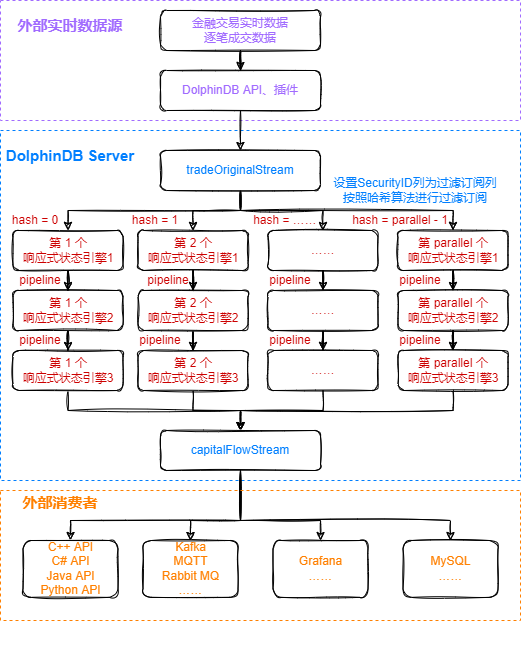
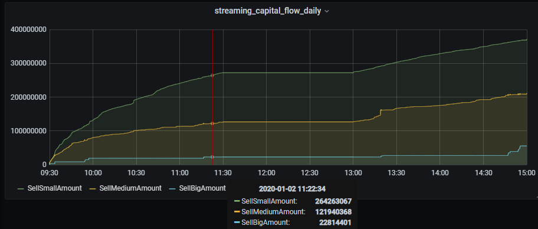

# DolphinDB流计算在金融行业的应用：实时计算日累计逐单资金流

在股票交易市场，资金流是一个重要的量价指标。资金流指标按照是否对交易订单号进行合并计算，可以分为**逐笔资金流**和**逐单资金流**；按照统计时间，可以分为**分钟资金流**和**日累计资金流**。其中**逐笔资金流**的处理逻辑比较简单，直接对每一笔成交记录的成交股数或者成交金额进行大小单的判断，然后进行相关指标的计算。而**逐单资金流**相对复杂一些，需要先根据买卖订单号进行合并，然后进行大小单的判断和相关指标的计算。

关于实时计算**逐单分钟资金流**的解决方案，可以参考教程：[ DolphinDB流计算在金融行业的应用：实时计算分钟资金流](https://gitee.com/dolphindb/Tutorials_CN/blob/master/streaming_capital_flow_order_by_order.md)

本教程主要提供一种基于DolphinDB流数据处理框架，实时计算**日累计逐单资金流**的低延时解决方案。

> 注意：本教程后文提到的日累计资金流都是指日累计逐单资金流。

本教程包含内容：

- [1. 日累计资金流场景描述](#1-日累计资金流场景描述)
- [2. 日累计资金流指标实现](#2-日累计资金流指标实现)
- [3. 日累计资金流实时计算结果展示](#3-日累计资金流实时计算结果展示)
- [4. 性能测试](#4-性能测试)
- [5. 总结](#5-总结)
- [附件](#附件)

## 1. 日累计资金流场景描述

### 1.1 实时计算日累计资金流的难点

* 日累计逐单资金流计算中的大小单是一个动态的概念，一个小单在成交量增加后可能变成一个大单。
* 日累计逐单资金流的计算过程中涉及历史状态，如若不能实现增量计算，当计算下午的数据时，可能需要回溯有关这笔订单上午的数据，效率会非常低下。
* 该场景需要对每一笔成交记录做出一次响应，计算出每只股票截止当前成交记录的最新日累计资金流指标，实时计算压力较大。
* 计算涉及至少两个阶段：在第一阶段需要根据订单分组，根据订单的累计成交量判断大小单；在第二阶段要根据股票来分组，统计每个股票的大小单数量及成交额。
* 实时流计算场景中的低延时要求。

### 1.2 逐笔成交数据

本教程基于上交所2020年某日的逐笔成交数据进行代码调试，在DolphinDB中存储的表结构为：

| name        | typeString | comment    |
| ----------- | ---------- | ---------- |
| SecurityID  | SYMBOL     | 股票代码   |
| Market      | SYMBOL     | 交易所     |
| TradeTime   | TIMESTAMP  | 交易时间   |
| TradePrice  | DOUBLE     | 交易价格   |
| TradeQty    | INT        | 成交量     |
| TradeAmount | DOUBLE     | 成交额     |
| BuyNum      | INT        | 买单订单号 |
| SellNum     | INT        | 卖单订单号 |

### 1.3 日累计资金流指标

本教程示例代码计算的日累计资金流指标为：

| **指标名称**     | **含义**                                                     |
| ---------------- | ------------------------------------------------------------ |
| TotalAmount      | 从开盘到当前记录，总成交额                                   |
| SellSmallAmount  | 从开盘到当前记录，卖方向小单的总成交额，成交股数小于等于2万股 |
| SellMediumAmount | 从开盘到当前记录，卖方向中单的总成交额，成交股数大于2万股、小于等于20万股 |
| SellBigAmount    | 从开盘到当前记录，卖方向大单的总成交额，成交股数大于20万股   |
| SellSmallCount   | 从开盘到当前记录，卖方向小单的总订单数，成交股数小于等于2万股 |
| SellMediumCount  | 从开盘到当前记录，卖方向中单的总订单数，成交股数大于2万股、小于等于20万股 |
| SellBigCount     | 从开盘到当前记录，卖方向大单的总订单数，成交股数大于20万股   |
| BuySmallAmount   | 从开盘到当前记录，买方向小单的总成交额，成交股数小于等于2万股 |
| BuyMediumAmount  | 从开盘到当前记录，买方向中单的总成交额，成交股数大于2万股、小于等于20万股 |
| BuyBigAmount     | 从开盘到当前记录，买方向大单的总成交额，成交股数大于20万股   |
| BuySmallCount    | 从开盘到当前记录，买方向小单的总订单数，成交股数小于等于2万股 |
| BuyMediumCount   | 从开盘到当前记录，买方向中单的总订单数，成交股数大于2万股、小于等于20万股 |
| BuyBigCount      | 从开盘到当前记录，买方向大单的总订单数，成交股数大于20万股   |

关于资金流大小单的划分规则，不同的开发者会有不同的定义方法。以常用的股票行情软件为例：

（1）[东方财富](https://emcreative.eastmoney.com/app_fortune/article/extend.html?artcode=20220117100406743919710)

* 超级大单：>50万股或100万元
* 大单：10-50万股或20-100万元
* 中单：2-10万股或4-20万元
* 小单：<2万股或4万元

（2）[新浪财经](http://finance.sina.com.cn/temp/guest4377.shtml)

* 特大单：>100万元
* 大单：20-100万元
* 小单：5-20万元
* 散单：<5万元

包括大智慧、同花顺等，不同软件之间的大小单区分规则都会有差异，但是判断条件都是基于成交股数或成交金额。

> 注意：本教程中，资金流大小单的判断条件基于成交股数，划分了大单、中单、小单三种，判断的边界值是随机定义的，开发者必须根据自己的实际场景进行调整。

### 1.4 日累计资金流增量计算方案

日累计逐单资金流的增量计算包括两个步骤。首先是计算每个买单或卖单的累计成交量，据此判断订单是大单，中单或小单。这一步的增量计算实现比较简单，只要按订单分组，并用cumsum计算累计的成交量。在此基础上，进一步按股票统计大小单的数量和交易金额等指标。这一步如果没有实现增量计算，那么每次统计大中小单的数量的耗时会越来越长，因为订单数量在不断的增加。事实上，如果我们能够获得某一订单当前时刻的状态（大单、中单、小单等）以及前一个时刻的状态，第二步的增量计算就非常简单。



处理流程图说明：

* tradeOriginalStream是DolphinDB中的流数据表，用于接收实时数据源的数据并发布给流计算引擎进行实时计算。
* capitalFlowStream是DolphinDB中的流数据表，用于实时接收流计算引擎的计算结果，其数据可以被外部消费者订阅消费。
* `parallel`参数是指流计算的并行度，本教程中把逐笔成交表`tradeOriginalStream`中的数据对`SecurityID`字段（股票代码）按照哈希算法，相对均匀地发布到`parallel`个响应式状态引擎1实现并行计算。因为逐笔成交表的数据流量较大，且日累计逐单资金流指标的计算相对复杂，所以需要使用并行流处理。
* 响应式状态引擎1结合内置的[cumsum](https://www.dolphindb.cn/cn/help/200/FunctionsandCommands/FunctionReferences/c/cumsum.html), [prev](https://www.dolphindb.cn/cn/help/200/FunctionsandCommands/FunctionReferences/p/prev.html)函数，增量计算当前订单根据股票代码和买单订单号分组后的累计成交金额，以及当前订单合入前后的大小单标签、累计成交量，更详细的计算逻辑介在第2章的代码开发部分说明。
* 响应式状态引擎2结合内置的[cumsum](https://www.dolphindb.cn/cn/help/200/FunctionsandCommands/FunctionReferences/c/cumsum.html), [prev](https://www.dolphindb.cn/cn/help/200/FunctionsandCommands/FunctionReferences/p/prev.html)函数，增量计算当前订单根据股票代码和卖单订单号分组后的累计成交金额，以及当前订单合入前后的大小单标签、累计成交量，同时保留上一步买方向的中间计算结果，更详细的计算逻辑会在第2章的代码开发部分说明。
* 响应式状态引擎3结合内置的[cumsum](https://www.dolphindb.cn/cn/help/200/FunctionsandCommands/FunctionReferences/c/cumsum.html), [dynamicGroupCumsum](https://www.dolphindb.cn/cn/help/200/FunctionsandCommands/FunctionReferences/d/dynamicGroupCumsum.html), [dynamicGroupCumcount](https://www.dolphindb.cn/cn/help/200/FunctionsandCommands/FunctionReferences/d/dynamicGroupCumcount.html)函数实现根据股票代码合并的资金流指标的增量计算，更详细的计算逻辑会在第2章的代码开发部分说明。

## 2. 日累计资金流指标实现

本教程代码开发工具采用[DolphinDB GUI](https://www.dolphindb.cn/cn/gui/index.html)，所有代码均可在DolphinDB GUI客户端开发工具执行。

### 2.1 创建相关流数据表

```
def createStreamTableFunc(){
	//create stream table: tradeOriginalStream
	colName = `SecurityID`Market`TradeTime`TradePrice`TradeQty`TradeAmount`BuyNum`SellNum
	colType = [SYMBOL, SYMBOL, TIMESTAMP, DOUBLE, INT, DOUBLE, INT, INT]
	tradeOriginalStreamTemp = streamTable(20000000:0, colName, colType)
	try{ enableTableShareAndPersistence(table=tradeOriginalStreamTemp, tableName="tradeOriginalStream", asynWrite=true, compress=true, cacheSize=20000000, retentionMinutes=1440, flushMode=0, preCache=10000) }
	catch(ex){ print(ex) }
	undef("tradeOriginalStreamTemp")
	
	//create stream table: capitalFlow
	colName = `SecurityID`TradeTime`TotalAmount`SellSmallAmount`SellMediumAmount`SellBigAmount`SellSmallCount`SellMediumCount`SellBigCount`BuySmallAmount`BuyMediumAmount`BuyBigAmount`BuySmallCount`BuyMediumCount`BuyBigCount
	colType =  [SYMBOL, TIMESTAMP, DOUBLE, DOUBLE, DOUBLE, DOUBLE, INT, INT, INT, DOUBLE, DOUBLE, DOUBLE, INT, INT, INT]
	capitalFlowStreamTemp = streamTable(20000000:0, colName, colType)
	try{ enableTableShareAndPersistence(table=capitalFlowStreamTemp, tableName="capitalFlowStream", asynWrite=true, compress=true, cacheSize=20000000, retentionMinutes=1440, flushMode=0, preCache=10000) }
	catch(ex){ print(ex) }
	undef("capitalFlowStreamTemp")
	
	//create stream table: capitalFlowStream60min
	colName = `TradeTime`SecurityID`TotalAmount`SellSmallAmount`SellMediumAmount`SellBigAmount`SellSmallCount`SellMediumCount`SellBigCount`BuySmallAmount`BuyMediumAmount`BuyBigAmount`BuySmallCount`BuyMediumCount`BuyBigCount
	colType =  [TIMESTAMP, SYMBOL, DOUBLE, DOUBLE, DOUBLE, DOUBLE, INT, INT, INT, DOUBLE, DOUBLE, DOUBLE, INT, INT, INT]
	capitalFlowStream60minTemp = streamTable(1000000:0, colName, colType)
	try{ enableTableShareAndPersistence(table=capitalFlowStream60minTemp, tableName="capitalFlowStream60min", asynWrite=true, compress=true, cacheSize=1000000, retentionMinutes=1440, flushMode=0, preCache=10000) }
	catch(ex){ print(ex) }
	undef("capitalFlowStreamTemp")
}

createStreamTableFunc()
go
setStreamTableFilterColumn(tradeOriginalStream, `SecurityID)
```

* [go](https://www.dolphindb.cn/cn/help/200/ProgrammingStatements/go.html)语句的作用是对代码分段进行解析和执行。
* [setStreamTableFilterColumn](https://www.dolphindb.cn/cn/help/200/FunctionsandCommands/CommandsReferences/s/setStreamTableFilterColumn.html)函数作用是指定流数据表的过滤列，与[subscribeTable](https://www.dolphindb.cn/cn/help/200/FunctionsandCommands/FunctionReferences/s/subscribeTable.html)函数的 `filter` 参数配合使用。本教程中的作用是把逐笔成交表中的数据对股票代码按照哈希算法，相对均匀地发布到不同的流处理线程消费，实现并行计算的目的。

### 2.2 定义资金流大小单判断的函数

```
/* 
 * Label small, medium and large order
 * small : 0
 * medium : 1
 * large : 2
 */
@state
def tagFunc(qty){
    return iif(qty <= 20000, 0, iif(qty <= 200000 and qty > 20000, 1, 2))
}
```

* 成交股数小于等于2万股的订单标记为小单，标签为0；成交股数大于2万股、小于等于20万股的订单标记为中单，标签为1；成交股数大于20万股的订单标记为大单，标签为2。本教程中，资金流大小单的判断条件基于成交股数，划分了大单、中单、小单三种，判断的边界值是随机定义的，开发者必须根据自己的实际场景进行调整。
* 该函数将在响应式状态引擎中使用，所以需要用 @state 表示函数是自定义的状态函数。

### 2.3 根据股票和买单订单号合并的增量计算

```
def processBuyOrderFunc(parallel){
	metricsBuy = [
		<TradeTime>,
		<SellNum>,
		<TradeAmount>,
		<TradeQty>,
		<cumsum(TradeAmount)>,
		<tagFunc(cumsum(TradeQty))>,
		<prev(cumsum(TradeAmount))>,
		<prev(tagFunc(cumsum(TradeQty)))>]
	for(i in 1..parallel){
		createReactiveStateEngine(name="processBuyOrder"+string(i), metrics=metricsBuy, dummyTable=tradeOriginalStream, outputTable=getStreamEngine("processSellOrder"+string(i)), keyColumn=`SecurityID`BuyNum, keepOrder=true)
		subscribeTable(tableName="tradeOriginalStream", actionName="processBuyOrder"+string(i), offset=-1, handler=getStreamEngine("processBuyOrder"+string(i)), msgAsTable=true, hash=i, filter=(parallel, i-1))
	}
}
```

* `parallel`参数是指流计算的并行度，上述代码中是把逐笔成交表`tradeOriginalStream`中的数据对股票代码按照哈希算法，相对均匀地发布到`parallel`个响应式状态引擎1实现并行计算。这些响应式状态引擎1的计算逻辑相同，但是处理的股票不同。

* 上述代码中通过DolphinDB的响应式状态引擎和内置的[cumsum](https://www.dolphindb.cn/cn/help/200/FunctionsandCommands/FunctionReferences/c/cumsum.html), [prev](https://www.dolphindb.cn/cn/help/200/FunctionsandCommands/FunctionReferences/p/prev.html)函数实现流式增量计算，分组字段为`SecurityID`和`BuyNum`，即股票代码和**买单订单号**。

* `metricsBuy`中的内容为响应式状态引擎中以元代码形式表示的计算公式：
```
metricsBuy = [
  	<TradeTime>,
  	<SellNum>,
  	<TradeAmount>,
  	<TradeQty>,
  	<cumsum(TradeAmount)>,
  	<tagFunc(cumsum(TradeQty))>,
  	<prev(cumsum(TradeAmount))>,
  	<prev(tagFunc(cumsum(TradeQty)))>]
```
  `<TradeTime>`, `<SellNum>`, `<TradeAmount>`, `<TradeQty>`是**无状态**的计算，作用是保留原始表中这些字段的原始信息，输入给下一层的响应式状态引擎计算使用。`<cumsum(TradeAmount)>`, `<tagFunc(cumsum(TradeQty))>`, `<prev(cumsum(TradeAmount))>`, `<prev(tagFunc(cumsum(TradeQty)))>`是**有状态**的计算，分别计算了每一条成交记录所代表的股票按照此记录的**买单订单号**合并后的累计成交金额、当前成交记录合入后根据累计成交量判断的大小单标签、当前成交记录合入前的累计成交金额、当前成交记录合入前根据累计成交量判断的大小单标签，作用是作为第三层响应式状态引擎中的[dynamicGroupCumsum](https://www.dolphindb.cn/cn/help/200/FunctionsandCommands/FunctionReferences/d/dynamicGroupCumsum.html), [dynamicGroupCumcount](https://www.dolphindb.cn/cn/help/200/FunctionsandCommands/FunctionReferences/d/dynamicGroupCumcount.html)函数的输入，增量计算买方向的资金流指标。这些有状态因子的计算都是通过**流式增量计算**的方法实现的。

为了方便开发者快速理解这块代码的计算逻辑，下面我们输入一些样本数据来观察第一层响应式状态引擎的运行：

* 逐笔成交表`tradeOriginalStream`中写入5条数据


* 经过第一层响应式状态引擎的处理后，输出为


上述代码对股票代码为`60000`的逐笔成交数据按照**买单订单号**`69792`进行合并计算，在响应式状态引擎中对每一笔输入都会进行一次响应计算，所以输出结果的条数和输入记录的条数相等。结果表中的`TotalBuyAmount`, `BuyOrderFlag`, `PrevTotalBuyAmount`, `PrevBuyOrderFlag`分别代表每一条成交记录所代表的股票按照此记录的**买单订单号**合并后的累计成交金额、当前成交记录合入后根据累计成交量判断的大小单标签、当前成交记录合入前的累计成交金额、当前成交记录合入前根据累计成交量判断的大小单标签，这些有状态因子的计算都是通过**流式增量计算**的方法实现的。

### 2.4 根据股票和卖单订单号合并的增量计算

```
def processSellOrderFunc(parallel){
	colName = `SecurityID`BuyNum`TradeTime`SellNum`TradeAmount`TradeQty`TotalBuyAmount`BuyOrderFlag`PrevTotalBuyAmount`PrevBuyOrderFlag
	colType =  [SYMBOL, INT, TIMESTAMP, INT, DOUBLE, INT, DOUBLE, INT, DOUBLE, INT]
	processBuyOrder = table(1:0, colName, colType)
	metricsSell = [
		<TradeTime>,
		<TradeAmount>,
		<cumsum(TradeAmount)>,
		<tagFunc(cumsum(TradeQty))>,
		<prev(cumsum(TradeAmount))>,
		<prev(tagFunc(cumsum(TradeQty)))>,
		<BuyNum>,
		<TotalBuyAmount>,
		<BuyOrderFlag>,
		<PrevTotalBuyAmount>,
		<PrevBuyOrderFlag>]
	for(i in 1..parallel){
		createReactiveStateEngine(name="processSellOrder"+string(i), metrics=metricsSell, dummyTable=processBuyOrder, outputTable=getStreamEngine("processCapitalFlow"+string(i)), keyColumn=`SecurityID`SellNum, keepOrder=true)
	}
}
```

* `parallel`参数是指流计算的并行度，上述代码中是创建了`parallel`个响应式状态引擎2，这些响应式状态引擎2的输入是对应的`parallel`个响应式状态引擎1的输出，实现并行计算。这些响应式状态引擎2的计算逻辑相同，但是处理的股票不同。

* 上述代码中通过DolphinDB的响应式状态引擎和内置的[cumsum](https://www.dolphindb.cn/cn/help/200/FunctionsandCommands/FunctionReferences/c/cumsum.html), [prev](https://www.dolphindb.cn/cn/help/200/FunctionsandCommands/FunctionReferences/p/prev.html)函数实现流式增量计算，分组字段为`SecurityID`和`SellNum`，即股票代码和**卖单订单号**。

* `metricsSell`中的内容为响应式状态引擎中以元代码形式表示的计算公式：
```
metricsSell = [
  	<TradeTime>,
  	<TradeAmount>,
  	<cumsum(TradeAmount)>,
  	<tagFunc(cumsum(TradeQty))>,
  	<prev(cumsum(TradeAmount))>,
  	<prev(tagFunc(cumsum(TradeQty)))>,
  	<BuyNum>,
  	<TotalBuyAmount>,
  	<BuyOrderFlag>,
  	<PrevTotalBuyAmount>,
  	<PrevBuyOrderFlag>]
```
  `<TradeTime>`, `<TradeAmount>`, `<BuyNum>`, `<TotalBuyAmount>`, `<BuyOrderFlag>`, `<PrevTotalBuyAmount>`, `<PrevBuyOrderFlag>`是**无状态**的计算，作用是保留原始表中这些字段的原始信息，输入给下一层的响应式状态引擎计算使用。`<cumsum(TradeAmount)>`, `<tagFunc(cumsum(TradeQty))>`, `<prev(cumsum(TradeAmount))>`, `<prev(tagFunc(cumsum(TradeQty)))>`是**有状态**的计算，分别计算了每一条成交记录所代表的股票按照此记录的**卖单订单号**合并后的累计成交金额、当前成交记录合入后根据累计成交量判断的大小单标签、当前成交记录合入前的累计成交金额、当前成交记录合入前根据累计成交量判断的大小单标签，作用是作为第三层响应式状态引擎中的[dynamicGroupCumsum](https://www.dolphindb.cn/cn/help/200/FunctionsandCommands/FunctionReferences/d/dynamicGroupCumsum.html), [dynamicGroupCumcount](https://www.dolphindb.cn/cn/help/200/FunctionsandCommands/FunctionReferences/d/dynamicGroupCumcount.html)函数的输入，增量计算卖方向的资金流指标。这些有状态因子的计算都是通过**流式增量计算**的方法实现的。

为了方便开发者快速理解这块代码的计算逻辑，下面我们输入一些样本数据来观察第二层响应式状态引擎的运行：

* 第二层响应式状态引擎的输入为


* 经过第二层响应式状态引擎的处理后，输出为


上述代码对股票代码为`60000`的逐笔成交数据按照**卖单订单号**`38446`, `70031`, `143303`, `155394`, `38433`进行合并计算，在响应式状态引擎中对每一笔输入都会进行一次响应计算，所以输出结果的条数和输入记录的条数相等。结果表中的`TotalSellAmount`, `SellOrderFlag`, `PrevTotalSellAmount`, `PrevSellOrderFlag`分别代表每一条成交记录所代表的股票按照此记录的**卖单订单号**合并后的累计成交金额、当前成交记录合入后根据累计成交量判断的大小单标签、当前成交记录合入前的累计成交金额、当前成交记录合入前根据累计成交量判断的大小单标签，这些有状态因子的计算都是通过**流式增量计算**的方法实现的。

### 2.5 根据股票合并的资金流指标的增量计算

```
def processCapitalFlowFunc(parallel){
	colName = `SecurityID`SellNum`TradeTime`TradeAmount`TotalSellAmount`SellOrderFlag`PrevTotalSellAmount`PrevSellOrderFlag`BuyNum`TotalBuyAmount`BuyOrderFlag`PrevTotalBuyAmount`PrevBuyOrderFlag
	colType =  [SYMBOL, INT, TIMESTAMP, DOUBLE, DOUBLE, INT, DOUBLE, INT,  INT, DOUBLE, INT, DOUBLE, INT]
	processSellOrder = table(1:0, colName, colType)
	metrics1 = <dynamicGroupCumsum(TotalSellAmount, PrevTotalSellAmount, SellOrderFlag, PrevSellOrderFlag, 3)> 
	metrics2 = <dynamicGroupCumcount(SellOrderFlag, PrevSellOrderFlag, 3)> 
	metrics3 = <dynamicGroupCumsum(TotalBuyAmount, PrevTotalBuyAmount, BuyOrderFlag, PrevBuyOrderFlag, 3)> 
	metrics4 = <dynamicGroupCumcount(BuyOrderFlag, PrevBuyOrderFlag, 3)>
	for(i in 1..parallel){
		createReactiveStateEngine(name="processCapitalFlow"+string(i), metrics=[<TradeTime>, <cumsum(TradeAmount)>, metrics1, metrics2, metrics3, metrics4], dummyTable=processSellOrder, outputTable=capitalFlowStream, keyColumn=`SecurityID, keepOrder=true)
	}
}
```

* `parallel`参数是指流计算的并行度，上述代码中是创建了`parallel`个响应式状态引擎3，这些响应式状态引擎3的输入是对应的`parallel`个响应式状态引擎2的输出，实现并行计算。这些响应式状态引擎3的计算逻辑相同，但是处理的股票不同。

* 上述代码中通过DolphinDB的响应式状态引擎和内置的[cumsum](https://www.dolphindb.cn/cn/help/200/FunctionsandCommands/FunctionReferences/c/cumsum.html), [dynamicGroupCumsum](https://www.dolphindb.cn/cn/help/200/FunctionsandCommands/FunctionReferences/d/dynamicGroupCumsum.html), [dynamicGroupCumcount](https://www.dolphindb.cn/cn/help/200/FunctionsandCommands/FunctionReferences/d/dynamicGroupCumcount.html)函数实现流式增量计算，分组字段为`SecurityID`，即股票代码。

* `metrics`中的内容为响应式状态引擎中以元代码形式表示的计算公式：
```
metrics1 = <dynamicGroupCumsum(TotalSellAmount, PrevTotalSellAmount, SellOrderFlag, PrevSellOrderFlag, 3)> 
metrics2 = <dynamicGroupCumcount(SellOrderFlag, PrevSellOrderFlag, 3)> 
metrics3 = <dynamicGroupCumsum(TotalBuyAmount, PrevTotalBuyAmount, BuyOrderFlag, PrevBuyOrderFlag, 3)> 
metrics4 = <dynamicGroupCumcount(BuyOrderFlag, PrevBuyOrderFlag, 3)>
metrics = [<TradeTime>, <cumsum(TradeAmount)>, metrics1, metrics2, metrics3, metrics4]
```
  `<TradeTime>`是**无状态**的计算，作用是保留每一条计算结果的原始时间信息。`<cumsum(TradeAmount)>`是**有状态**的计算，表示从开盘到当前记录，该只股票的总成交额。`metrics1`中的`<dynamicGroupCumsum(TotalSellAmount, PrevTotalSellAmount, SellOrderFlag, PrevSellOrderFlag, 3)>`是**有状态**的计算，**输入**是当前成交记录所代表的股票按照此记录的**卖单订单号**合并后的累计成交金额、当前成交记录合入前的累计成交金额、当前成交记录合入后根据累计成交量判断的大小单标签、当前成交记录合入前根据累计成交量判断的大小单标签、大小单标签数量，**输出**是表示从开盘到当前记录，该只股票的卖方向小单的总成交额、卖方向中单的总成交额、卖方向大单的总成交额。`metrics2`中的`<dynamicGroupCumcount(SellOrderFlag, PrevSellOrderFlag, 3)>`是**有状态**的计算，**输入**是当前成交记录所代表的股票按照此记录的**卖单订单号**合并后根据累计成交量判断的大小单标签、当前成交记录合入前根据累计成交量判断的大小单标签、大小单标签数量，**输出**是表示从开盘到当前记录，该只股票的卖方向小单的总订单数、卖方向中单的总订单数、卖方向大单的总订单数。`metrics3`和`metrics4`也都是**有状态**的计算，表示买方向的资金流指标，与卖方向的计算逻辑相似，不在展开阐述。这些有状态因子的计算都是通过**流式增量计算**的方法实现的。

为了方便开发者快速理解这块代码的计算逻辑，下面我们输入一些样本数据来观察第三层响应式状态引擎的运行：

* 第三层响应式状态引擎的输入为


* 经过第三层响应式状态引擎的处理后，输出为


上图为股票代码为`60000`的日累计逐单资金流指标计算结果。在响应式状态引擎中对每一笔输入都会进行一次响应计算，所以输出结果的条数和输入记录的条数相等。结果表中的`TotalAmount`表示从开盘到当前记录，该只股票的总成交额，计算表达式是`<cumsum(TradeAmount)>`，输入是每一笔交易的成交额，是通过[响应式状态引擎](https://www.dolphindb.cn/cn/help/200/FunctionsandCommands/FunctionReferences/c/createReactiveStateEngine.html)和[cumsum](https://www.dolphindb.cn/cn/help/200/FunctionsandCommands/FunctionReferences/c/cumsum.html)累计求和函数实现**流式增量计算**的。结果表中的`SellSmallAmount`, `SellMediumAmount`, `SellBigAmount`表示从开盘到当前记录，该只股票的卖方向小单的总成交额、卖方向中单的总成交额、卖方向大单的总成交额，计算表达式是`<dynamicGroupCumsum(TotalSellAmount, PrevTotalSellAmount, SellOrderFlag, PrevSellOrderFlag, 3)> `，输入是当前成交记录所代表的股票按照此记录的**卖单订单号**合并后的累计成交金额、当前成交记录合入前的累计成交金额、当前成交记录合入后根据累计成交量判断的大小单标签、当前成交记录合入前根据累计成交量判断的大小单标签和大小单标签数量，是通过[响应式状态引擎](https://www.dolphindb.cn/cn/help/200/FunctionsandCommands/FunctionReferences/c/createReactiveStateEngine.html)和[dynamicGroupCumsum](https://www.dolphindb.cn/cn/help/200/FunctionsandCommands/FunctionReferences/d/dynamicGroupCumsum.html)函数实现**流式增量计算**的，在日累计资金流实时计算场景中，随着交易量的不断增加，某个订单的类别可能从一个小单变成大单，此时需要从小单累计统计量中减去该笔订单已经累计的值，并在大单累计统计量中加上该笔订单的最新累计值，[dynamicGroupCumsum](https://www.dolphindb.cn/cn/help/200/FunctionsandCommands/FunctionReferences/d/dynamicGroupCumsum.html)函数即可应用在这类场景下。结果表中的`SellSmallCount`, `SellMediumCount`, `SellBigCount`表示从开盘到当前记录，该只股票的卖方向小单的总订单数、卖方向中单的总订单数、卖方向大单的总订单数，计算表达式是`<dynamicGroupCumcount(SellOrderFlag, PrevSellOrderFlag, 3)> `，输入是是当前成交记录所代表的股票按照此记录的**卖单订单号**合并后根据累计成交量判断的大小单标签、当前成交记录合入前根据累计成交量判断的大小单标签和大小单标签数量，是通过[响应式状态引擎](https://www.dolphindb.cn/cn/help/200/FunctionsandCommands/FunctionReferences/c/createReactiveStateEngine.html)和[dynamicGroupCumcount](https://www.dolphindb.cn/cn/help/200/FunctionsandCommands/FunctionReferences/d/dynamicGroupCumcount.html)函数实现**流式增量计算**的，在日累计资金流实时计算场景中，随着交易量的不断增加，某个订单的类别可能从一个小单变成大单，此时需要从小单累计统计量中减1，并在大单累计统计量中加1，[dynamicGroupCumcount](https://www.dolphindb.cn/cn/help/200/FunctionsandCommands/FunctionReferences/d/dynamicGroupCumcount.html)函数即可应用在这类场景下。结果表中的`BuySmallAmount`, `BuyMediumAmount`, `BuyBigAmount`, `BuySmallCount`, `BuyMediumCount`, `BuyBigCount`表示买方向的日累计资金流指标，与卖方向的计算逻辑相似，不在展开阐述，也是通过[响应式状态引擎](https://www.dolphindb.cn/cn/help/200/FunctionsandCommands/FunctionReferences/c/createReactiveStateEngine.html)和[dynamicGroupCumsum](https://www.dolphindb.cn/cn/help/200/FunctionsandCommands/FunctionReferences/d/dynamicGroupCumsum.html), [dynamicGroupCumcount](https://www.dolphindb.cn/cn/help/200/FunctionsandCommands/FunctionReferences/d/dynamicGroupCumcount.html)函数实现**流式增量计算**的。

### 2.6 固定频率往外推送计算结果

```
def processCapitalFlow60minFunc(){
	aggrMetrics = <[
		last(TotalAmount),
		last(SellSmallAmount),
		last(SellMediumAmount),
		last(SellBigAmount),
		last(SellSmallCount),
		last(SellMediumCount),
		last(SellBigCount),
		last(BuySmallAmount),
		last(BuyMediumAmount),
		last(BuyBigAmount),
		last(BuySmallCount),
		last(BuyMediumCount),
		last(BuyBigCount)]>
	createDailyTimeSeriesEngine(name="processCapitalFlow60min", windowSize=60000*60, step=60000*60, metrics=aggrMetrics, dummyTable=capitalFlowStream, outputTable=capitalFlowStream60min, timeColumn="TradeTime", useSystemTime=false, keyColumn=`SecurityID, useWindowStartTime=false)
	subscribeTable(tableName="capitalFlowStream", actionName="processCapitalFlow60min", offset=-1, handler=getStreamEngine("processCapitalFlow60min"), msgAsTable=true, batchSize=10000, throttle=1, hash=0)
}
```

* 分组字段为`SecurityID`，即股票代码。
* 通过DolphinDB的时间序列聚合引擎对资金流指标结果表做实时的**60分钟滚动窗口**计算，**聚合函数**为`last`。
* 实时计算的数据源为日累计资金流结果表capitalFlowStream，虽然该表的数据流量较大（和原始逐笔成交表的数据流量一样大），但是由于是做简单的60分钟滚动指标计算，所以只需要单线程处理，不需要使用并行流处理。

### 2.7 注册订阅引擎和订阅流数据表

```
parallel = 3
processCapitalFlowFunc(parallel)
go
processSellOrderFunc(parallel)
go
processBuyOrderFunc(parallel)
processCapitalFlow60minFunc()
```

* `parallel`参数是指流计算的并行度。
* 本教程设置`parallel=3`，表示资金流计算的并行度为3，能够支撑的上游逐笔交易数据的最大流量为5万条每秒。2022年1月某日，沪深两市全市场股票，在09:30:00开盘时候的逐笔交易数据流量峰值可以达到4.2万笔每秒，所以生产环境部署的时候，为了避免因流量高峰时流处理堆积造成延时增加的现象，可以将`parallel`设置为3，提高系统实时计算的最大负载。

### 2.8 历史数据回放

```
//replay history data
t = select * from loadTable("dfs://trade", "trade") where time(TradeTime) between 09:30:00.000 : 15:00:00.000 order by TradeTime, SecurityID
submitJob("replay_trade", "trade",  replay{t, tradeOriginalStream, `TradeTime, `TradeTime, 50000, true, 1})
getRecentJobs()
```

执行完后，返回如下信息：


如果endTime和errorMsg为空，说明任务正在正常运行中。

## 3. 日累计资金流实时计算结果展示

### 3.1 节点内的计算结果表

计算结果表`capitalFlowStream`，可以通过DolphinDB所有API查询接口实时查询，通过DolphinDB GUI实时查看该表的结果，返回：


### 3.2 固定频率往外推送计算结果

计算结果表`capitalFlowStream`的数据量和逐笔成交数据量是一样的，对每一笔成交记录做一次响应。

如果开发者需要定时取一次截面上每一只股票的最新日累计资金流指标，可以通过DolphinDB内置的时间序列计算引擎，在滚动窗口内取每一只股票的最后一条计算结果即可。本教程中对计算结果表`capitalFlowStream`进行了实时滚动窗口的计算，窗口大小是60分钟，计算结果存储在`capitalFlowStream60min`流数据表中，数据内容如下图所示：


### 3.3 Grafana实时监控结果




## 4. 性能测试

本教程测试了单次响应计算和连续响应计算两种场景。测试数据为上交所2020年某天1558只股票的逐笔成交数据。

### 4.1 单次响应计算性能测试

本教程使用了3个响应式状态引擎串联的流水线处理，单次响应计算时间为从第1个引擎收到输入至第3个引擎输出结果所经历的时间，测试了单只股票响应计算一次和1558只股票响应计算一次的性能。统计了10次的总耗时，取平均值作为单次的耗时。测试使用的服务器CPU为Intel(R) Xeon(R) Silver 4216 CPU @ 2.10GHz。单线程情况下，测试结果如下：

| 股票个数 | 耗时(单位:ms) |
| -------- | ------------- |
| 1        | 0.18          |
| 1558     | 2.09          |

### 4.2 连续响应计算性能测试

本教程使用了3个响应式状态引擎串联的流水线处理，计算的并行度为3，能够支撑的上游逐笔交易数据的最大流量为5万条每秒。以上交所2020年某天1558只股票的1632万条逐笔成交数据为测试数据，通过DolphinDB的[replay](https://www.dolphindb.cn/cn/help/200/FunctionsandCommands/FunctionReferences/r/replay.html)回放工具，把历史数据以流数据的方式注入到流计算最上游的流数据表tradeOriginalStream，回放速度是全速，计算总耗时是326秒，处理的能力是5万条每秒。开发者可以增加计算的并行度，提高系统的处理能力。

## 5. 总结

DolphinDB内置的流数据框架支持流数据的发布，订阅，预处理，实时内存计算，复杂指标的滚动窗口计算、滑动窗口计算、累计窗口计算等，是一个运行高效、使用便捷的流数据处理框架。

本教程基于DolphinDB流数据处理框架，提供了一种实时计算日累计逐单资金流的低延时解决方案，旨在提高开发人员在使用 DolphinDB 内置的流数据框架开发流计算业务场景时的开发效率、降低开发难度，更好地挖掘 DolphinDB 在复杂实时流计算场景中的价值。

## 附件

**业务代码**

[01.清理环境并创建相关流数据表](script/streaming_capital_flow_daily/01.createStreamTB.txt)

[02.注册流计算引擎和订阅流数据表](script/streaming_capital_flow_daily/02.createEngineSub.txt)

[03.历史数据回放](script/streaming_capital_flow_daily/03.replay.txt)

[04.流计算状态监控函数](script/streaming_capital_flow_daily/04.streamStateQuery.txt)

**开发环境**

* CPU 类型：Intel(R) Xeon(R) Silver 4216 CPU @ 2.10GHz
* 逻辑 CPU 总数：8
* 内存：64GB
* OS：64位 CentOS Linux 7 (Core)
* 磁盘：SSD 盘，最大读写速率为 520MB/s
* server 版本：1.30.18，2.00.6